# Air Quality Review (AQR) System
## Standard Operating Procedure (SOP) & User Manual
**Document Reference: SOP-AQR-001**  
**GAMP 5 Software Category: Category 4 (Configured Software)**  
**Validated Data Analytics for Industrial Environmental Compliance**  
**Version: 1.1.0**  

---

## Document Control & Revision History

| Version | Date | Author | Reviewer / Role | Approver / Role | Description of Changes |
| :--- | :--- | :--- | :--- | :--- | :--- |
| **1.0.0** | 2026-05-15 | System Architect | QA Validation Manager | QA Director | Initial release under GAMP 5 Category 4 guidelines. |
| **1.1.0** | 2026-05-20 | Lead Software Engineer | Lead Validator | QA Director | Added Phase II (EMS) data integration, non-blocking SSE streaming architecture, lazy chart loading, and requestAnimationFrame DOM batching. |

---

## 1. Scope & Compliance Objectives
The **Air Quality Review (AQR) System** is a standalone, GAMP 5 Category 4 compliant software designed to automate the ingestion, validation, alignment, and analysis of environmental monitoring data. The system reads Building Automation System (BAS - Phase I) and Environmental Monitoring System (EMS - Phase II) records to evaluate compliance for:
*   **Temperature (°C)**
*   **Relative Humidity (%RH)**
*   **Relative Room Pressure (Pa)**

### Data Integrity & Regulatory Objectives:
1.  **GxP Validation Compliance**: Enforces strict, immutable calculations of environmental limits to satisfy regulatory requirements.
2.  **Tamper-Evident Logs (ALCOA+)**: Cryptographically chain-linked audit trails preventing data modification.
3.  **Algorithmic Verification**: Ensures zero human-error margins in calculating violation continuous windows (25-minute rule) and corridor-room pressure differentials.

---

## 2. Installation & System Launch Setup

### 2.1 Software Prerequisites
For standard execution via the packaged standalone binary, ensure the following target operating environment is met:
*   **Operating System**: Windows 10 / Windows 11 (64-bit).
*   **Microsoft VC++ Redistributable (x64)**: This component must be installed on the host PC. Lack of this redistributable results in a `Failed to load Python DLL` startup error.
*   **Local Port Availability**: Port `5000` must not be bound to other system services.

### 2.2 Standard Target Folder Structure
The application requires specific directory folders in its execution path:
```
AirQualityReview/
├── app.exe               # Packaged single standalone binary
├── reports/              # Target folder where Excel reports are written (Auto-created)
└── logs/                 # Folder containing GAMP 5 audit trail logs (Auto-created)
```
> [!IMPORTANT]
> **Regulatory Notice**: The `logs/audit_trail.log` file must not be modified, deleted, or moved. The system will perform an integrity check of the log file's cryptographic hash chain on startup. If a mismatch is detected, execution halts immediately.

### 2.3 Starting the Application
1.  Navigate to the directory containing `app.exe`.
2.  Double-click `app.exe` (or execute `python app.py` if running in development mode).
3.  A console background worker launches. Within 5–15 seconds, your default web browser opens automatically to:
    `http://127.0.0.1:5000/aqr`

---

## 3. Step-by-Step Dashboard Operations & Navigation

This section details the explicit user interface navigation. It explains which buttons to click, the fields present, and the operational behavior of each screen.

### 3.1 Main Air Quality Review Dashboard (`/aqr`)

```
======================================================================================
[ AIR QUALITY REVIEW SYSTEM (AQR) v1.1.0 ]                             [TRANSFORM]
======================================================================================
  CONFIGURATION SIDEBAR                    |  ROOM & AREA SELECTOR
                                           |  
  1. Source Mode Selector:                 |  [ AREA: AHU-01 ] [ Select All ] [ Clear All ]
     [x] Phase I (BAS)  [ ] Phase II (EMS) |  
                                           |  [x] Room 1-P038  [ Dispensing Room A ]
  2. Select Data Source Folder:            |  [x] Room 1-P039  [ Dispensing Room B ]
     [ D:/Data/Raw_CSVs               ]    |  [ ] Room 1-P040  [ Sampling Room ]
     Button: [ Browse Folder ]             |  
                                           |  ------------------------------------------------
  3. Select SetPoint Limit File:           |  [ GENERATE SUMMARY REPORTS ]
     [ D:/Limits/SetPointLimit.xlsx   ]    |  
     Button: [ Browse File ]               |  ------------------------------------------------
                                           |  AQR PROGRAM DETAILED ANALYSIS LOG (SSE TERMINAL)
  4. Define Date-Time Range:               |  [ 09:34:12 ] [INFO] System initialized.
     Start: [ 2026-05-19 00:00 ]           |  [ 09:34:15 ] [INFO] Loaded limits for 150 rooms.
     End:   [ 2026-05-20 00:00 ]           |  [ 09:34:20 ] [INFO] Processing Room: 1-P038...
                                           |  [ 09:34:22 ] [INFO] Completed Room: 1-P038
  5. Action:                               |  [ 09:34:25 ] [Done] Report written.
     Button: [ Scan & Load Rooms ]         |  
                                           |  [ DOWNLOAD REPORT ]  [ GENERATE VISUAL GRAPHS ]
======================================================================================
```

#### Step 3.1.1: Configuration Sidebar Layout & Field Meanings

##### 1. Source Mode Selector (Toggle Control)
*   **Purpose**: Switches the background ingestion engine between BAS flat-file parsing and EMS folder-tree parsing.
*   **User Action**: Click the radio option for **Phase I (BAS)** or **Phase II (EMS)** depending on the origin of the environmental data.
*   *Backend Impact*: Configures input delimiters (comma `,` vs semicolon `;`), scientific notation parsing, and the folder search strategy.

##### 2. Raw CSV Folder Selector (Browse Control)
*   **Purpose**: Defines the source directory containing the raw sensor data logs.
*   **User Action**: Click the **Browse Folder** button. An OS-native directory selection window opens. Select the target folder and click **OK**.
*   *Field Display*: The absolute path to the directory (e.g., `D:/ex_work/AirQualityReview_Project/data/C`) will be displayed in the input field.

##### 3. SetPoint Limit File Selector (File Browse Control)
*   **Purpose**: Selects the reference configuration spreadsheet containing sensor warning limits for each room.
*   **User Action**: Click the **Browse File** button. An OS-native file dialog opens. Select the appropriate spreadsheet (`SetPointLimit.xlsx` for Phase I or `SetPointLimit_Phase2.xlsx` for Phase II) and click **Open**.
*   *Field Display*: Displays the absolute file path (e.g., `D:/ex_work/AirQualityReview_Project/data/SetPointLimit.xlsx`).

##### 4. Define Date-Time Range (Temporal Input Fields)
*   **Purpose**: Controls the exact period boundaries for the analysis.
*   **User Action**: Input fields are styled calendar pickers. The user can type or click the calendar icon to set:
    *   **Start Date/Time**: format `YYYY-MM-DD HH:MM`
    *   **End Date/Time**: format `YYYY-MM-DD HH:MM`
*   *Auto-Population Feature*: Upon scanning the folder, the system peeks at the metadata of the files and automatically populates these inputs with the earliest and latest date-times found.

##### 5. Scan & Load Available Rooms Button (Action Control)
*   **Purpose**: Reads the setpoint sheet and cross-references it with available CSV folders to discover valid room IDs in the specified date range.
*   **User Action**: Click the **Scan & Load Rooms** button.
*   *Visual Response*: A loading spinner displays. The system populates the **Room & Area Selector Panel** on the right with available locations grouped by their functional Area (e.g., Module 1, AHU-01).

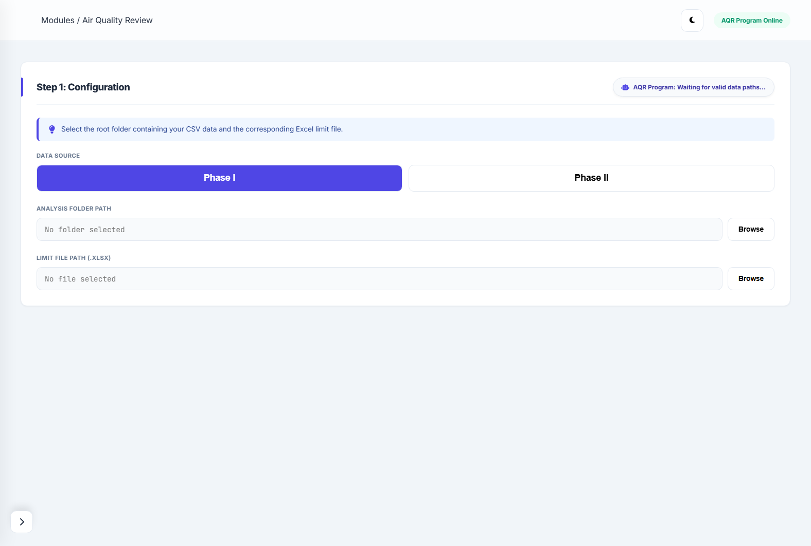

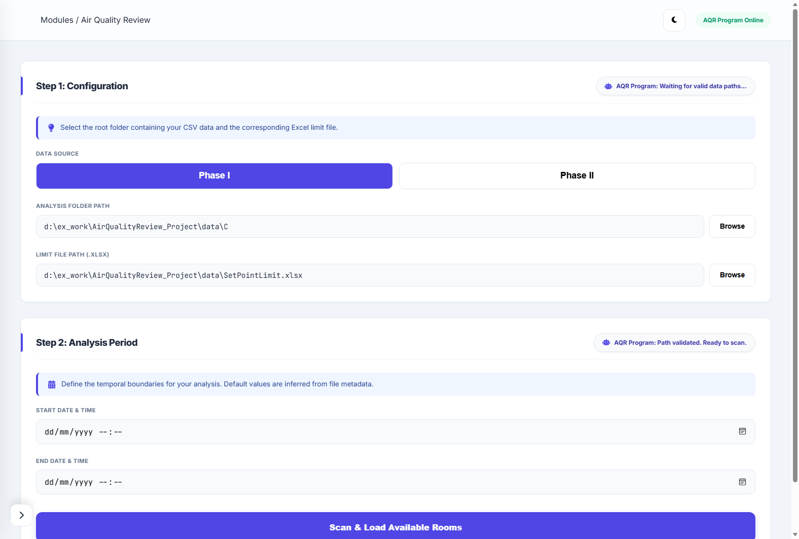

---

#### Step 3.1.1.1: Auxiliary Navigation & Utility Controls (About, Information, Reset, Close)
Located at the top and left sidebar pane of the web client, these utility links provide critical diagnostic information, session management, and application termination tools:

##### 1. Information Panel (`javascript:showInfoModal()`)
*   **Purpose**: Renders a GAMP 5 validation summary and cGMP operational workflow overview on screen.
*   **Visual Interface**: A pop-up dialog displaying:
    *   *Purpose & GxP Scope*: Outlining how the AQR Dashboard satisfies the regulatory review of Temperature, Relative Humidity, and Differential Pressure.
    *   *Operational SOP & Workflows*: Direct instruction lists on preparing files, configuring directories, executing reviews, and interactive threshold tuning.
    *   *Temporal Boundary Standard*: Details explaining that temporal boundaries are strictly parsed from internal timestamps rather than file metadata to ensure data integrity.
*   **User Action**: Click **Close** at the bottom of the modal window to return to the active dashboard.

##### 2. About Panel (`javascript:showAboutModal()`)
*   **Purpose**: Displays system identity, versioning metadata, and the cryptographic details of the secure audit trail.
*   **Visual Interface**: A modal popup outlining:
    *   *System Identity*: Air Quality Review (AQR) Validation Dashboard v1.1.0.
    *   *Secure Cryptographic Audit Trail*: Confirms SHA-256 chain-linked integrity protocols used to seal all log files.
    *   *WSGI Server Isolation*: Identifies that the application runs on Waitress WSGI production server to secure environmental records against typical development server vulnerabilities.
    *   *Automated Cache Buster*: Lists Hot-Reload Engine (v2.2) integration.
    *   *Author Info*: Attributed to **Thanawat Lueangwirot**.
*   **User Action**: Click the green **Close** button to close the modal.

##### 3. Reset Application (`javascript:location.reload()`)
*   **Purpose**: Performs a complete client-side session reset.
*   **User Action**: Click **Reset Application** in the sidebar navigation.
*   *System Behavior*: Performs a standard DOM reload. All textboxes, room selection checkboxes, loaded graphs, and stream buffers are instantly cleared, returning the dashboard to its verified pristine initial boot state.

##### 4. Close Application (`javascript:shutdownApp()`)
*   **Purpose**: Shuts down the background Flask server and worker process, freeing local port 5000.
*   **User Action**: Click **Close Application**.
*   *Interaction Confirmation*: A native browser confirmation dialog prompt: `"Are you sure you want to close the AQR Program?"`.
*   *Process Actions*: Clicking **OK** triggers an HTTP request to the `/shutdown` endpoint. The backend initializes a shutdown worker thread, sleeps for 500ms, and terminates the OS process with `os._exit(0)`. The browser window then automatically closes after 1 second.

---

#### Step 3.1.2: Room & Area Selection Panel
*   **User Navigation**: Use the area dropdown checkboxes to filter rooms by area groupings.
*   **Select All / Deselect All Controls**: Click these buttons to select or clear all checkboxes in the active view.
*   **Individual Room Checkboxes**: Review the unique `Room ID` and corresponding `Room Name` from the sheet. Check the specific rooms you are authorized or tasked to audit.

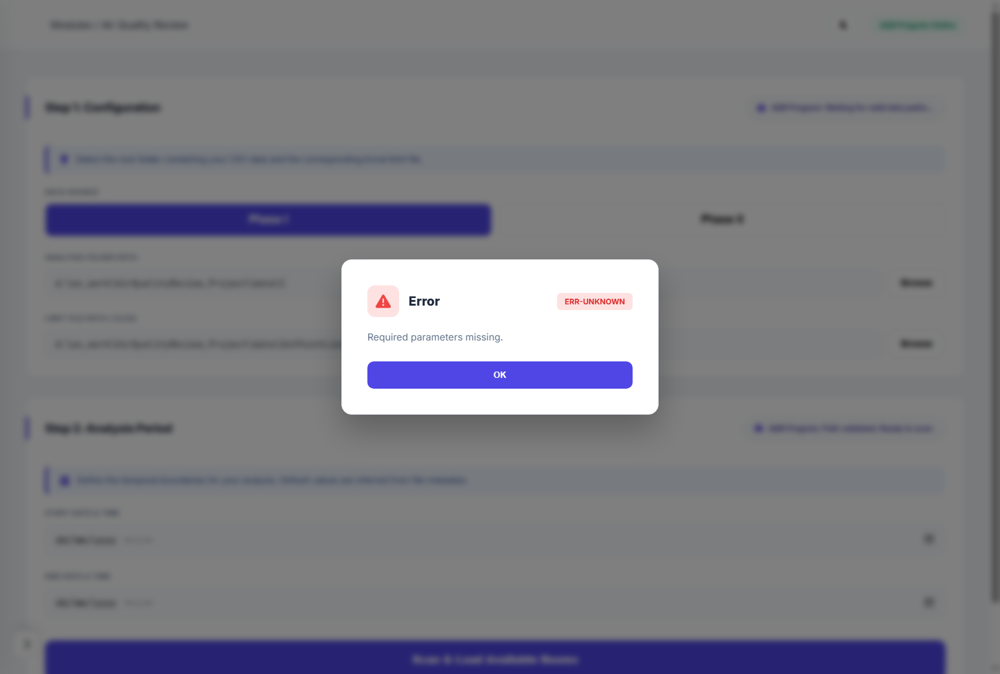

---

#### Step 3.1.3: Executing the Ingestion & Review (Generate Summary Reports)
1.  Verify the sidebar parameters and checked rooms are correct.
2.  Click the blue **[ GENERATE SUMMARY REPORTS ]** button.
3.  The system immediately acquires `_analysis_lock` on the backend, spawns an asynchronous analytical background thread, and streams live console logs to the interface.

##### The SSE Log Terminal Window:
*   **Background Mechanism**: Streams console lines in real-time via Server-Sent Events (`/stream/<job_id>`).
*   **Under-the-Hood Safety**: JS buffers incoming SSE packets and utilizes `requestAnimationFrame` to flush the output to the DOM, limiting updates to 60 frames per second. This prevents web page hangs or browser memory starvation when parsing tens of thousands of rows.
*   **User Output**: Real-time room status updates, violation reports, and diagnostic messages scroll inside the console terminal in real-time.


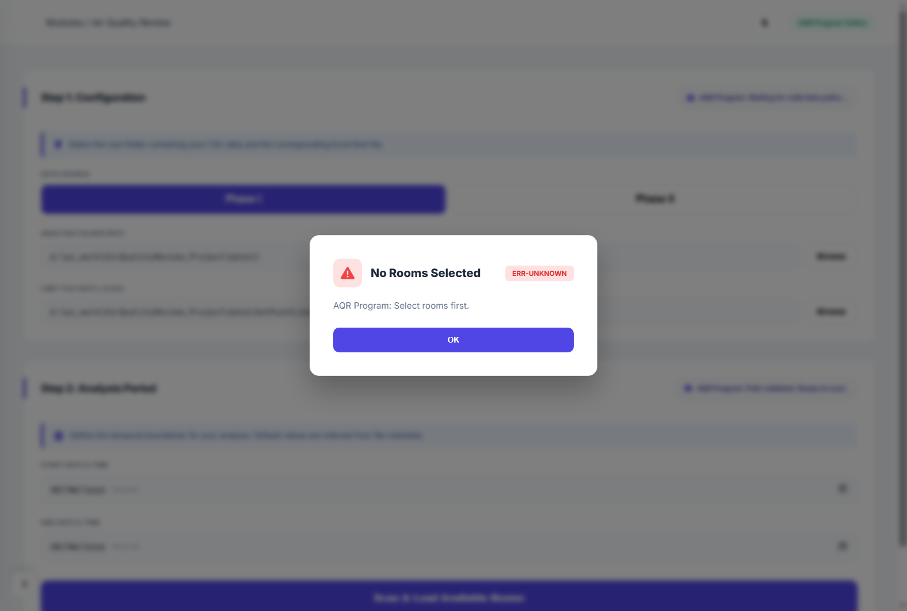

---

#### Step 3.1.4: Downloading the Immutable Report
*   Upon analysis completion, the log terminal prints `[Done] Report written: AQR_Report_YYYYMMDD_HHMMSS.xlsx`.
*   The green **[ DOWNLOAD REPORT ]** button is activated.
*   **User Action**: Click **Download Report**. Your browser downloads the spreadsheet from `/download/<filename>`.

##### Structure of the Generated Excel Report:
*   **Top Row**: Period analyzed (`YYYY-MM-DD HH:MM` to `YYYY-MM-DD HH:MM`), Software Version (`v1.1.0`), and Timestamp of Generation.
*   **Date Group Separator Rows**: The system prints a light-gray date banner row (`DATE: YYYY-MM-DD`) for every calendar date evaluated.
*   **Data Columns**:
    1.  `Room no.` (e.g., `1-P038`) - Left Aligned.
    2.  `Room name` (e.g., `Dispensing Room A`) - Left Aligned.
    3.  `Specification` - Details the specific limits tested (e.g., `Temperature: ≤ 25.0 °C \n Humidity: 30 - 60 %RH \n Pressure: 10 - 20 Pa`).
    4.  `Analysis results` - Immutably documents compliance status:
        *   `Passed`: Clean records with zero violations.
        *   `Out of spec`: Explicit violation duration intervals listed (e.g., `12:15 to 12:45 (25.1 to 25.3 °C)`).
        *   `Data Loss`: Records containing `NaN` (sensor data failure).
        *   `Out of spec & Data Loss`: Mixed failure modes.
        *   `N/A`: No limits or sensors configured for the parameter.

---

#### Step 3.1.5: Interacting with the Graphical Visualizations Panel
*   Once analysis finishes, the gray **[ GENERATE VISUAL GRAPHS ]** button activates.
*   **User Action**: Click **Generate Visual Graphs**. The frontend triggers a lazy-load HTTP GET request to `/plot/<job_id>`. This lazy-load design ensures that massive data frames (millions of points) are not loaded unless requested by the user, saving substantial processing memory.

```
======================================================================================
[ DYNAMIC PLOT CONTROLS: TEMPERATURE, HUMIDITY, & PRESSURE MULTI-MONITOR ]
======================================================================================
  [1H] [1D] [7D] [30D] [ALL]  | Room: [ 1-P038 - Dispensing Room A | v ]
  
  [ TEMPERATURE PLOT ]
   25.0 °C  ------------------- Draggable Limit Line --------------------------------
            /\  /\  /\
   22.0 °C /  \/  \/  \________ Time-Series Data Curve
  
  [ HUMIDITY PLOT ]
   60.0 %RH ------------------- Draggable Limit Line --------------------------------
   30.0 %RH ------------------- Draggable Limit Line --------------------------------
            /\      /\
   45.0 %RH/  \____/  \________ Time-Series Data Curve
  
  [ PRESSURE CORRELATION PLOT ]
   20.0 Pa  ------------------- Draggable Limit Line --------------------------------
   10.0 Pa  ------------------- Draggable Limit Line --------------------------------
            /\      /\
   15.0 Pa /  \____/  \________ Time-Series Data Curve (Synchronized X-Axis)
======================================================================================
```

##### Visual Components Breakdown:
1.  **Violation Intensity Heatmap**: Day × Hour visual grid. High-intensity red blocks indicate concurrent violations across multiple rooms, pinpointing systemic facility issues.
2.  **Violation Timeline**: Gantt-style chart displaying exactly *when* and *for how long* a room was out of specification.
3.  **Violation Overview**: A stacked bar chart summing total violations per room, categorized by Temp, Humidity, and Pressure.
4.  **Statistical Violation Table**: A searchable grid displaying raw violation counts. Clicking a row automatically isolates that specific room in the detailed time-series plots below.
5.  **Time-Series Monitors (Temperature, Humidity, Pressure)**:
    *   **X-Axis Synchronization**: Panning or zooming on one plot automatically pans and zooms the other two plots to the exact same temporal point.
    *   **Draggable Limit Lines**: Standard upper and lower control limits are displayed as dotted colored lines. Users can drag these lines vertically on screen; dragging them automatically updates the input threshold variables to perform real-time visual "what-if" testing on the data.


---

#### Step 3.1.6: In-Depth Scientific Interpretation & Data Analysis Guide

The graphical visualization suite is designed not just for simple monitoring, but as a high-fidelity diagnostic toolkit to aid in pharmaceutical validation and mechanical root-cause investigation. When reviewing environmental logs, operators should utilize each chart component as described below:

##### 1. Violation Intensity Heatmap (Temporal Facility Health at a Glance)

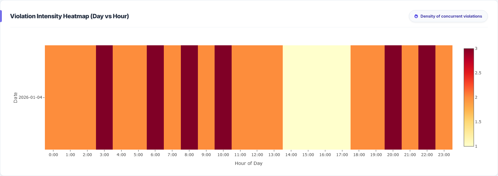

*   **How to Read It**: 
    *   The Heatmap displays a grid with the **Hour of the Day** (0 to 23) on the horizontal X-axis and the **Date of Ingestion** on the vertical Y-axis.
    *   Each grid cell is color-coded by the total count of rooms violating specification limits in that specific hour.
    *   *Color Code Scale*: A dark blue or deep teal color indicates $0$ violations. As the count of concurrent room violations increases, the color shifts to high-intensity bright yellow, orange, and finally deep crimson red.
*   **Operational Investigation Significance**: 
    *   **Systemic Failures**: A vertical red stripe on the heatmap represents overlapping violations across multiple rooms at the *same hour* across different days. This points to a programmed scheduling error (e.g., HVAC timers shutting down too early or going into night setback mode prematurely).
    *   **External Environmental Shocks**: A horizontal red stripe across a single day represents a major environmental excursion affecting all cleanrooms simultaneously. This typically points to external weather events (e.g., peak summer humidity exceeding mechanical chillers' dehumidification capacities) or a main air-handling unit (AHU) mechanical trip.

##### 2. Violation Timeline (Gantt Chart for Deviation Lingering Analysis)

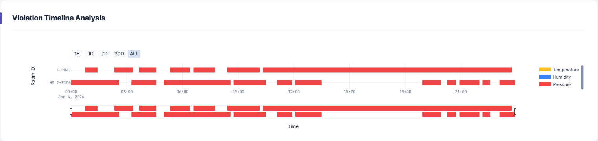

*   **How to Read It**:
    *   The horizontal X-axis maps the absolute chronological timeline (Date & Time), while the vertical Y-axis lists each unique **Room ID** that experienced out-of-specification events.
    *   Compliant periods are blank. Deviations are drawn as thick colored horizontal blocks.
*   **Operational Investigation Significance**:
    *   This chart measures the **lingering recovery duration** of the HVAC zones. 
    *   A room showing many thin, fragmented blocks suggests high-frequency noise or borderline operation where the temperature/humidity floats just above the limit but is pulled back quickly.
    *   A room showing a single solid, long horizontal block (e.g., 4 hours continuous) indicates a severe mechanical lockup or cooling coil failure where the system has lost control and cannot recover without manual engineering intervention.

##### 3. Violation Overview (Worst-Offender Stacked Bar Chart)

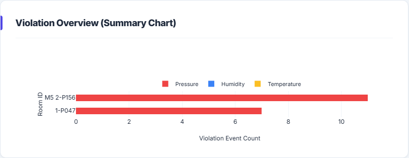

*   **How to Read It**:
    *   The horizontal X-axis displays individual **Room IDs**, and the vertical Y-axis counts the cumulative number of out-of-specification data points.
    *   Each bar is stacked and color-coded by physical parameter:
        *   **Red segment**: Temperature deviations.
        *   **Blue segment**: Relative Humidity deviations.
        *   **Green segment**: Differential Pressure deviations.
*   **Operational Investigation Significance**:
    *   This is the primary tool for **Preventive Maintenance (PM) prioritization**. 
    *   By looking at the tallest bars, quality engineers can instantly spot the facility's "worst offenders". If a room is towering above others with a massive red block, resources should be immediately dispatched to recalibrate or repair that room's temperature reheat valves, rather than wasting hours performing routine checks on stable, fully compliant rooms.

##### 4. Statistical Violation Table (Searchable Excursion Counts)

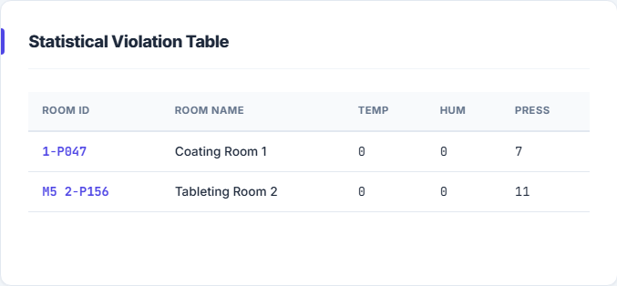

*   **How to Read It**:
    *   Displays a structured, searchable, and sortable data grid containing the exact counted instances of Temperature, Humidity, and Pressure excursions for each monitored cleanroom.
    *   *Interactive Filtering*: Users can utilize the live search text box to filter the grid down to specific rooms (e.g., `1-P038`) or physical parameters.
*   **Operational Investigation Significance**:
    *   **Direct Isolation**: Clicking on any individual room row in the table automatically isolates and highlights that exact cleanroom inside the time-series charts, allowing rapid, highly localized physical analysis without manual scrolling or dropdown searching.

##### 5. Time-Series Monitors (Dynamic Thermodynamic Cross-Correlation)

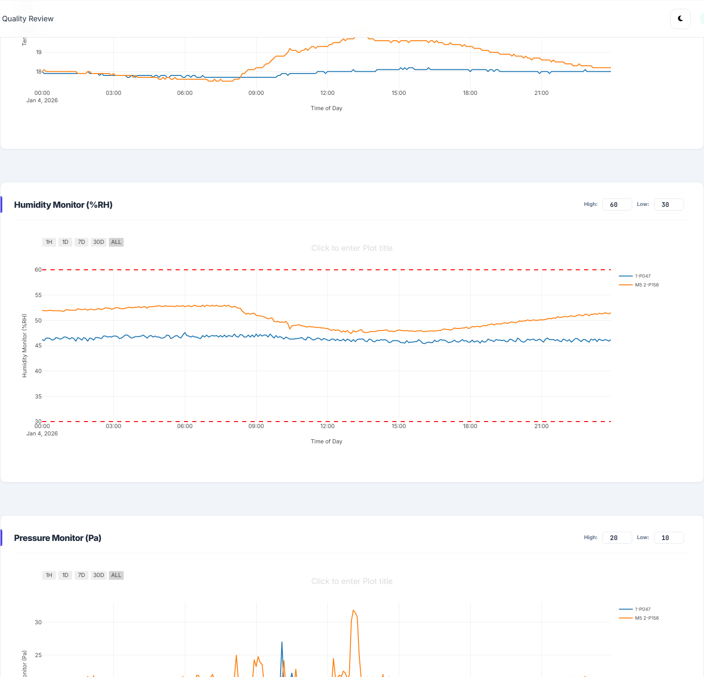

This panel consists of three stacked charts sharing an identical chronological timeline: Temperature, Relative Humidity, and Differential Pressure.
*   **How to Read It**:
    *   *Hover Tooltips*: Hovering your cursor over the data curve reveals an interactive pop-up box displaying the precise timestamp, the exact physical sensor value (e.g., `23.4 °C`), and the active SetPoint limits.
    *   **Multi-Panel Zoom & Pan Synchronization**: Panning (clicking and dragging the chart left/right) or zooming in (drawing a zoom box over a specific region) on the *Temperature* chart automatically triggers the *Humidity* and *Pressure* charts to zoom and pan to the exact same temporal point.
*   **Operational Investigation Significance (Thermodynamic Correlation)**:
    *   Cleanroom environments are tightly bound by physical laws: temperature changes directly affect relative humidity, and AHU fan speeds affect pressure.
    *   By zooming into a specific pressure drop, the validator can instantly inspect the temperature and humidity curves at that exact second. For example, if a pressure drop is preceded by a sudden temperature spike, it indicates that the air density change or supply valve adjustment disturbed the room's pressure equilibrium.
*   **Draggable Control Limits (What-If Scenario Analysis)**:
    *   The upper and lower specification limits are drawn as colored horizontal dashed lines (e.g., red dashed line at 25.0 °C).
    *   **User Action**: Hover over the limit line until the cursor turns into a vertical resize arrow, then click and drag the line up or down.
    *   *Background Calculation*: Dragging the line dynamically triggers a backend recalibration thread. The system recalculates the violation counts using the new visual threshold in real-time, instantly highlighting new excursion zones on screen. This allows validators to answer critical engineering questions such as: *"If our standard operating limit is tightened from 25.0 °C to 24.0 °C to increase safety margins, how many hours of excursions would we have experienced last month?"*

---

### 3.2 Data Transformation Dashboard (`/transform`)

```
======================================================================================
[ DATA TRANSFORMATION MODULE ]                                         [BACK TO AQR]
======================================================================================
  
  Select Output Target Folder:
  [ D:/Data/Transformed_CSVs ]                                 [ Browse Output Dir ]
  
  1. Main Plant Ingestion (BAS consolidated files):
     RMT File (Temp): [ D:/BAS/RMT_report.csv ]                  [ Browse RMT File ]
     RMH File (Hum):  [ D:/BAS/RMH_report.csv ]                  [ Browse RMH File ]
     RPT File (Pres): [ D:/BAS/RPT_report.csv ]                  [ Browse RPT File ]
     
  2. Module 5 Ingestion:
     Consolidated:    [ D:/BAS/M5_consolidated.csv ]             [ Browse M5 File  ]
     
  3. Pilot Plant Ingestion:
     Consolidated:    [ D:/BAS/Pilot_consolidated.csv ]          [ Browse Pilot File ]
     
  ------------------------------------------------------------------------------------
  [ EXECUTE SPLIT AND TRANSFORM ]
  ------------------------------------------------------------------------------------
  Output Progress Console:
  [INFO] Ingestion started...
  [INFO] Splitting Module 5: Created Room M5 1-P002_05-19-26_00-00.csv
  [INFO] Splitting Main Plant: Created Room 1-P038_05-19-26_00-00.csv
  [INFO] Split complete. 142 room CSVs written successfully.
======================================================================================
```

*   **Purpose**: Consolidates and splits massive, multi-room building automation report files into standardized, room-specific daily CSV files required for Phase I processing.
*   **Step-by-Step Execution**:
    1.  **Browse Output Folder**: Click **Browse Output Dir** to select where the converted flat-files will be written.
    2.  **Configure Input Files**:
        *   *For Main Plant*: Ingest the separate RMT (Temperature), RMH (Humidity), and RPT (Pressure) flat sheets via their respective browse buttons.
        *   *For Module 5 / Pilot Plant*: Ingest the consolidated CSV files.
    3.  **Transform Action**: Click **[ EXECUTE SPLIT AND TRANSFORM ]**.
    4.  *Backend Process*: The system maps columns dynamically to find specific room indices using regular expressions, matches timestamps, structures Point 1/2/3 headers, and outputs daily flat files to the target directory.

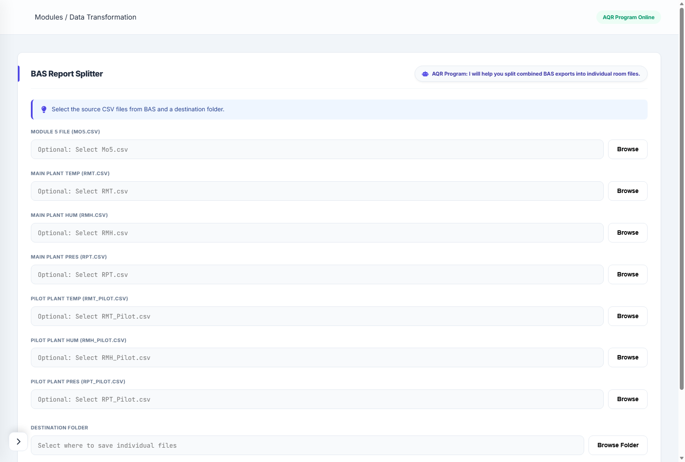

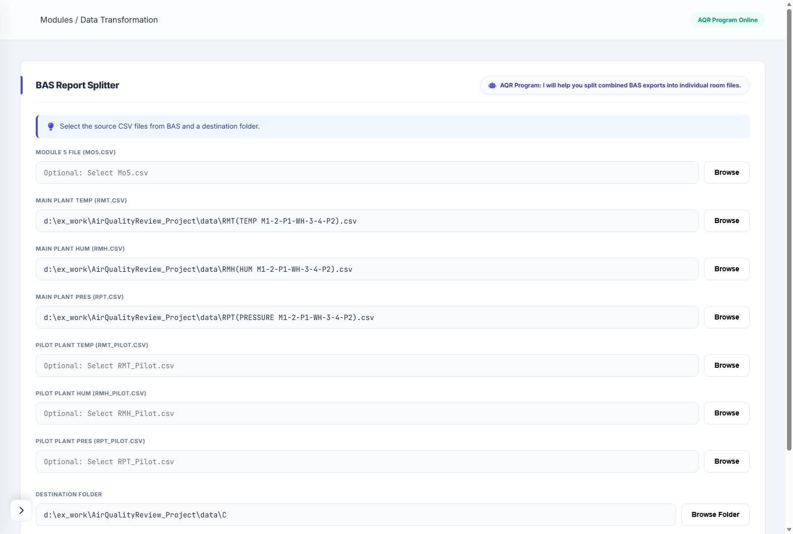

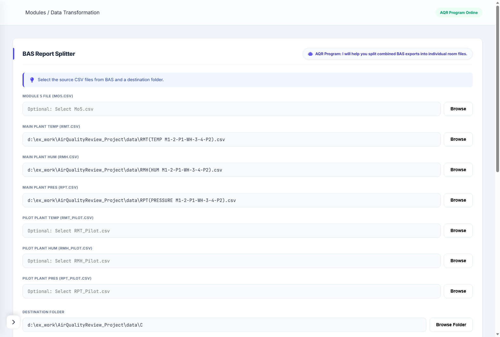

---

## 4. Technical Core & Backend Processing Logic

This section details the critical functions in `analysis_logic.py` that perform the calculations and maintain system compliance.

### 4.1 Data Ingestion, Processing & GxP Validation Flowchart

The diagram below represents the end-to-end logical flow of the Air Quality Review (AQR) system during raw file analysis, showing data ingestion, cryptographic validation (ALCOA+), data cleaning, alignment, limit validation (including the 25-minute continuous deviation window), and report generation.

#### 4.1.1 Process Architecture Diagram

```mermaid
graph TD
    A[Start: Operator Clicks 'Generate Summary Reports'] --> B[Ingest Configuration Parameters]
    B --> B1[Load Selected Source Mode: Phase I BAS or Phase II EMS]
    B --> B2[Load Target Date-Time Range]
    B --> B3[Load Selected Room Names / IDs]
    
    B1 & B2 & B3 --> C[Load SetPointLimit.xlsx Configuration]
    C --> C1[Read Setpoint Limits: High/Low Temp, Hum, Pres for each Room]
    
    C1 --> D[Ingest Raw Environmental Sensor Data CSVs]
    D --> D1[GxP ALCOA+: Calculate Cryptographic SHA-256 Hash of Raw Files]
    D1 --> D2[Write Ingestion Event & Hash values to logs/audit_trail.log]
    
    D2 --> E[Sensor Point Column Mapping & Parsing]
    E --> E1{Source Mode?}
    E1 -- Phase I BAS --> E2[Parse Flat-File Headers: Locate Point_X index for Temp/Hum/Pres]
    E1 -- Phase II EMS --> E3[Traverse Folder Tree: Ingest individual room CSV log files]
    
    E2 & E3 --> F[Temporal Alignment & Data Cleansing]
    F --> F1[Filter data points strictly within date-time boundary]
    F1 --> F2[Clean Room Name strings e.g. M5 prefixes]
    F2 --> F3[Handle Missing Values / Interpolate Minor Gaps]
    
    F3 --> G[cGxP Environmental Limit & Threshold Validation]
    G --> G1[Compare each data point against Setpoint Limits]
    G1 --> G2{Value out of limits?}
    
    G2 -- No --> G3[Mark sample as Compliant / Normal]
    G2 -- Yes --> H[Execute 25-Minute Continuous Window Rule]
    
    H --> H1[Calculate continuous duration of excursion]
    H1 --> H2{Duration > 25 minutes?}
    H2 -- No --> H3[Mark as Transient Spike / Non-OOS Incident]
    H2 -- Yes --> H4[Register as GxP Out-of-Specification OOS Violation]
    H4 --> H5[Capture Start/End Time, Duration, and Peak Deviation Value]
    
    G3 & H3 & H5 --> I[Corridor Pressure Differential Alignment]
    I --> I1[Validate relative adjacent room pressures for air-flow containment]
    
    I1 --> J[Report Compilation & Secure Output Generation]
    J --> J1[Generate Multi-Sheet Excel Report in reports/ folder]
    J1 --> J2[GAMP 5: Append secure log to logs/audit_trail.log with chain-link hash]
    J2 --> J3[Return Ingestion JSON to Dashboard Front-End]
    
    J3 --> K[UI Rendering: Plotly Dashboard visual charts & Interactive Limits]
    K --> L[End: Interactive Graph Stack Loaded]
    
    style A fill:#415a77,stroke:#778da9,stroke-width:2px,color:#fff
    style D1 fill:#9b2226,stroke:#ae2012,stroke-width:2px,color:#fff
    style D2 fill:#9b2226,stroke:#ae2012,stroke-width:2px,color:#fff
    style H4 fill:#d90429,stroke:#ef233c,stroke-width:2px,color:#fff
    style J1 fill:#1b4332,stroke:#2d6a4f,stroke-width:2px,color:#fff
    style J2 fill:#1b4332,stroke:#2d6a4f,stroke-width:2px,color:#fff
    style L fill:#415a77,stroke:#778da9,stroke-width:2px,color:#fff
```

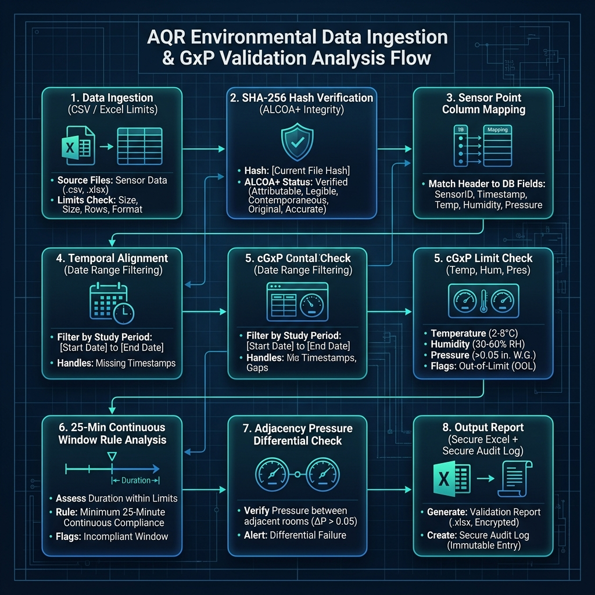

#### 4.1.2 Step-by-Step Functional Analysis of the Processing Flow

1. **Step 1: Configuration Ingestion**
   * The backend gathers the operational boundaries set by the operator, including the environmental data source folder, the GxP baseline limit spreadsheet (`SetPointLimit.xlsx`), the target validation date-time range, and the specific cleanroom numbers/names chosen for review.

2. **Step 2: Cryptographic Integrity Lock (ALCOA+ Compliance)**
   * Prior to processing any raw sensor values, the system calculates a cryptographically strong **SHA-256 hash** of the selected CSV data file.
   * This hash acts as an immutable digital fingerprint. If the file is altered, edited, or corrupted after review, the hash will change, triggering a GxP alarm.
   * This action, alongside the target file's details, is immediately logged to the `logs/audit_trail.log` file using chain-linking cryptographic hashes.

3. **Step 3: Sensor Point Column Mapping**
   * Raw CSV datasets often contain dozens of generic columns (e.g., `Point_1`, `Point_2`, `Point_3`).
   * The parser scans the CSV header block, reads the column-to-sensor mappings, and dynamically links each column to its corresponding room identifier (e.g., matching `Point_3` to `Room 1-P040 TEMP` or `.RMT`).
   * This dynamic mapping prevents hardcoded column errors and ensures data is loaded from the correct sensor channel.

4. **Step 4: Temporal Alignment & Data Cleansing**
   * The parsed data is filtered to keep only the timestamps within the operator's specified date-time boundary.
   * Cleanroom identifiers are normalized (e.g., stripping `"M5 "` or fixing character formatting).
   * Minor missing data values are handled according to predefined data validation rules to avoid interrupting calculations.

5. **Step 5: GxP Limits Matching & Threshold Comparison**
   * The system compares every single data point against the matched GxP upper and lower control limits loaded from `SetPointLimit.xlsx`.
   * For example, standard high-limit setpoints are checked (e.g., Temp > 25°C, Hum > 60%RH).

6. **Step 6: The "25-Minute Rule" Evaluation (OOS Deviation Guard)**
   * Short, transient spikes (e.g., a door opening for 2 minutes during an operator's entry) are normal in industrial environments and are classified as **non-OOS incidents**.
   * If a value violates the limit **continuously for more than 25 minutes** (which is equivalent to 5 consecutive out-of-limit samples at a 5-minute sampling frequency), it represents a significant risk to cleanroom sterility and is logged as an **official GxP Out-of-Specification (OOS) violation**.
   * The system records the precise start time, end time, total duration, and peak out-of-limit value for audit readiness.

7. **Step 7: Relative Pressure Containment Differential Check**
   * The algorithm checks relative room pressures between adjacent containment zones (corridors vs cleanrooms).
   * It ensures air-flow moves from clean to less-clean zones (positive pressure maintenance). If a pressure reversal occurs, it flags it as a containment breach.

8. **Step 8: Output Compilation (Secure Report & Audit Trail)**
   * Once calculations are complete, the system writes a highly styled, professional multi-tab Excel report containing:
     * A dashboard summary of compliance.
     * Statistical summaries (Min, Max, Mean, SD) for every room.
     * A detailed chronological GxP Violation Log.
     * Ingestion hashes and digital signatures for data traceability.
   * A final cryptographic line is written to `logs/audit_trail.log` to certify that the analysis completed successfully and the report is secure.
   * The frontend receives the analysis data in structured JSON, immediately launching Plotly charts (Timeline, Heatmap, worst-offender bars, and stacked time-series plots) for interactive validation.

---

### 4.2 Core Code Functions

#### 1. Ingesting Phase I Flat Files: `prepare_df(file_path)`
This function reads, validates, and standardizes flat Phase I CSV sensor records into clean, structured Pandas DataFrames.

```python
def prepare_df(file_path, target_room_id=None):
    # Strict read-only mode 'r' to prevent raw source file modification
    with open(file_path, 'r', encoding='utf-8', errors='ignore') as file:
        line_lst = [line.replace('"','').replace('\n','') for line in file.readlines()]
        header_index = find_header(line_lst)
        if header_index is None:
            # GAMP 5 Compliance: HALT on missing critical structural tags
            raise ValueError(f"ERR-001: Critical Error - Header '<>Date' not found in file: {file_path}")
        
        # Ingest filename metadata to discover target room
        if target_room_id is None:
            filename = os.path.basename(file_path)
            base_name = os.path.splitext(filename)[0]
            parts = base_name.split('_')
            if len(parts) >= 3:
                target_room_id = '_'.join(parts[:-2])
            elif len(parts) >= 1:
                target_room_id = parts[0]
        
        # Parse data table
        line_lst = [line.split(',') for line in line_lst]
        df = pd.DataFrame(line_lst[header_index:])
        df.columns = df.iloc[0]
        df = df[1:]
        df = df[~df["<>Date"].str.contains('*', regex=False, na=False)]
        
        # Standardize date-time objects
        df['DateTime'] = pd.to_datetime(df["<>Date"] + " " + df["Time"], errors='coerce')
        df = df.drop_duplicates(subset=['DateTime'])
        df = df.reset_index(drop=True).dropna()
        
        # Map Point names to standard physical sensor labels
        column_mapping = {"Point_1": "Temperature", "Point_2": "Humidity", "Point_3": "Pressure"}
        available_cols = df.columns.tolist()
        rename_map = {k: v for k, v in column_mapping.items() if k in available_cols}
        df = df.rename(columns=rename_map)
        
        # Enforce GxP Mandatory Data Presence
        mandatory_cols = ['DateTime', 'Temperature', 'Humidity']
        missing_mandatory = [col for col in mandatory_cols if col not in df.columns]
        if missing_mandatory:
            raise ValueError(f"ERR-005: Invalid File Format - Required columns {missing_mandatory} not found. ({os.path.basename(file_path)})")
            
        if 'Pressure' not in df.columns:
            df['Pressure'] = pd.NA
        
        required_cols = ['DateTime', 'Temperature', 'Humidity', 'Pressure']
        df = df.reindex(columns=required_cols)
        
        # Convert values to numeric with error trapping for invalid textual inputs
        numeric_cols = ['Temperature', 'Humidity', 'Pressure']
        for col in numeric_cols:
            if col in df.columns:
                original_nulls = df[col].isna().sum()
                df[col] = pd.to_numeric(df[col], errors='coerce')
                new_nulls = df[col].isna().sum()
                if new_nulls > original_nulls:
                    audit_trail.log_event("WARNING", f"Non-numeric data found in column {col} for file {os.path.basename(file_path)}")
    
    return df
```

#### 2. Recursive Search for Continuous Violation Windows: `find_continuous_ranges(lst, min_length)`
Calculates the boundary indices of consecutive sequence points to evaluate GxP violation windows.

```python
def find_continuous_ranges(lst, min_length=6):
    """GAMP 5: Group consecutive sequence numbers to calculate continuous duration blocks."""
    if not lst:
        return []

    result = []
    current_range = [lst[0]]
    start = lst[0]

    for i in range(1, len(lst)):
        if lst[i] == lst[i - 1] + 1:
            current_range.append(lst[i])
        else:
            if len(current_range) >= min_length:
                result.append((current_range[0], current_range[-1]))
            start = lst[i]
            current_range = [start]

    if len(current_range) >= min_length:
        result.append((current_range[0], current_range[-1]))

    return result
```

#### 3. Temporal Real-Time Corridor Alignment: `check_reverse_violations(...)`
Matches the pressure reading of the main corridor room with high/low pressure target rooms within a strict temporal threshold.

```python
def check_reverse_violations(corridor_room_num, corridor_df, start_idx, end_idx, setpoint_df, selected_rooms, prepared_dfs_cache):
    summary_lines = []
    # Identify rooms dependent on this specific corridor
    dependent_rooms_df = setpoint_df[
        (setpoint_df['Room_number'].astype(str) != corridor_room_num) &
        (setpoint_df['Room_Pressure_Comparison'].astype(str) == corridor_room_num) &
        (setpoint_df['Room_number'].astype(str).isin(selected_rooms))
    ]
    if dependent_rooms_df.empty: 
        return []
        
    corridor_violation_df = corridor_df.loc[start_idx:end_idx]
    
    for _, dependent_row in dependent_rooms_df.iterrows():
        dependent_room_num = str(dependent_row['Room_number'])
        low_limit_d = dependent_row.get('Pressure_Low_Limit', None)
        is_high_pressure_d = (not pd.isna(low_limit_d) and float(low_limit_d) >= 35) if low_limit_d is not None else False
        
        if dependent_room_num not in prepared_dfs_cache: 
            continue
            
        df_d = prepared_dfs_cache[dependent_room_num]
        
        # GAMP 5: Align mismatched sensor timestamps dynamically using merge_asof with a 60s tolerance window
        comparison_df = pd.merge_asof(
            corridor_violation_df[['DateTime', 'Pressure']].sort_values('DateTime'),
            df_d[['DateTime', 'Pressure']].sort_values('DateTime'),
            on='DateTime', direction='nearest', tolerance=pd.Timedelta('60s'),
            suffixes=(f'_{corridor_room_num}', f'_{dependent_room_num}')
        ).dropna(subset=[f'Pressure_{dependent_room_num}']).reset_index(drop=True)

        if is_high_pressure_d:
            # High Pressure target room must be HIGHER than the corridor
            # Flag a violation if corridor pressure is greater than target room pressure
            bool_cond = comparison_df[f'Pressure_{corridor_room_num}'] > comparison_df[f'Pressure_{dependent_room_num}']
            mode = "over" 
        else:
            # Low Pressure target room must be LOWER than the corridor
            # Flag a violation if target room pressure is greater than corridor pressure
            bool_cond = comparison_df[f'Pressure_{dependent_room_num}'] > comparison_df[f'Pressure_{corridor_room_num}']
            mode = "under"

        true_indices = bool_cond[bool_cond].index
        if not true_indices.empty:
            rev_violation_df = comparison_df.loc[true_indices].copy()
            rev_violation_df['Diff'] = rev_violation_df[f'Pressure_{corridor_room_num}'] - rev_violation_df[f'Pressure_{dependent_room_num}']
            
            # Group into sequential intervals
            true_ranges = find_continuous_ranges(true_indices.tolist(), min_length=1)
            for r_start, r_end in true_ranges:
                t_start = comparison_df['DateTime'].iloc[r_start]
                t_end = comparison_df['DateTime'].iloc[r_end]
                summary_lines.append(f"\n  - {t_start.strftime('%H:%M')} to {t_end.strftime('%H:%M')} {mode} {dependent_room_num}")
                
    return summary_lines
```

---

### 4.2 The 25-Minute Violation Rule (Continuous Violations)
A critical business rule is that environmental deviations must not be flagged unless they persist continuously for **25 minutes or longer**.
*   Raw BAS/EMS files log sensor entries at exact **5-minute intervals**.
*   A 25-minute continuous window therefore corresponds to exactly **6 sequential readings** (from Time $T$ to $T + 25\text{ mins}$).
*   **The Continuity Equation**:
    $$\text{DateTime.diff}(5).\text{total\_seconds}() == 1500\text{ seconds}$$
*   By executing a diff with a period shift of 5, the system ensures that 6 points are evaluated. If there is a data gap or a missing reading (e.g., sample interval becomes 10 minutes), the total seconds will deviate from 1500, resetting the continuity filter. This satisfies strict regulatory tracking criteria.

---

### 4.3 GAMP 5 Secure Audit Trail
To satisfy regulatory requirements for electronic records, the system implements a tamper-evident audit trail (`audit_trail.py`) modeled after a cryptographic hash chain.

```
+-------------------------------------------------------+
|  Log Entry N                                          |
|  - Timestamp: "2026-05-20 09:34:12"                   |
|  - User: "sys_admin"                                  |
|  - Action: "ANALYSIS_START"                           |
|  - Prev_Hash: "8f5a2b...c3d1"                         |
|  - Entry_Hash: SHA256(data + Prev_Hash) ------------->+
+-------------------------------------------------------+
                                                        |
                                                        v
+-------------------------------------------------------+
|  Log Entry N+1                                        |
|  - Timestamp: "2026-05-20 09:34:25"                   |
|  - User: "sys_admin"                                  |
|  - Action: "ANALYSIS_SUCCESS"                         |
|  - Prev_Hash: "7a8b9c...d4e5" (Matches Entry N Hash)  |
|  - Entry_Hash: SHA256(data + Prev_Hash)               |
+-------------------------------------------------------+
```

#### Cryptographic Formula:
For every record added to `logs/audit_trail.log`, the system calculates:
$$\text{Entry Hash} = \text{SHA-256}(\text{Timestamp} \parallel \text{User} \parallel \text{Action} \parallel \text{Prev Hash})$$

#### Pre-Flight Verification on Startup:
When `app.py` launches, it runs `verify_audit_trail()`. It iterates sequentially through the entire log file, recalculating the SHA-256 hash of each line and verifying that the `prev_hash` field matches the hash of the preceding line. 
*   If a user tries to alter a previous line (e.g., changing the timestamp of an error, or deleting an action), the hash of that line changes.
*   This breaks the connection to all subsequent lines.
*   The startup check will immediately fail, raise **Fatal Error 004**, and execute `sys.exit(1)` to prevent unauthorized software usage.

---

## 5. Regulatory Error Code Reference

When the system encounters a validation or file integrity failure, it prints a standard GxP error code. Use this table to troubleshoot system exceptions:

| Error Code | Name | Root Cause | Corrective Action |
| :--- | :--- | :--- | :--- |
| **ERR-001** | Header Missing | The `<>Date` structural header row was not found in the processed CSV file. | Re-export the raw report from the BAS/EMS terminal with standard column headers. |
| **ERR-002** | Limit File Not Found | The specified SetPoint Excel spreadsheet does not exist at the target path. | Click **Browse File** to locate and link the correct `SetPointLimit.xlsx` sheet. |
| **ERR-003** | Invalid Configuration | The setpoint configuration contains non-numeric limits. | Open the setpoint sheet in Excel, verify all temperature, humidity, and pressure limits contain only numeric values, and save. |
| **ERR-004** | Audit Trail Corrupt | The cryptographic SHA-256 hash chain verification failed on startup. | The system has been tampered with or log records were deleted. Restore the system from a verified backup or contact the QA administrator. |
| **ERR-005** | Invalid File Format | Mandatory columns (`Temperature` or `Humidity`) are missing from the raw CSV file. | Check that the room CSV is from a validated sensor source and has not been truncated during export. |
| **ERR-006** | Logical Constraint | A logical error was found in the configuration (e.g., Low Limit is set higher than High Limit). | Open the SetPoint spreadsheet and ensure all `Low_Limit` cells are lower than their respective `High_Limit` cells. |
| **ERR-007** | Report Generation Failed | The system could not compile or write the final Excel report to the `/reports` directory. | Check that the target disk has sufficient storage capacity and that you have write permissions to the application directory. |

---
**End of Document**
