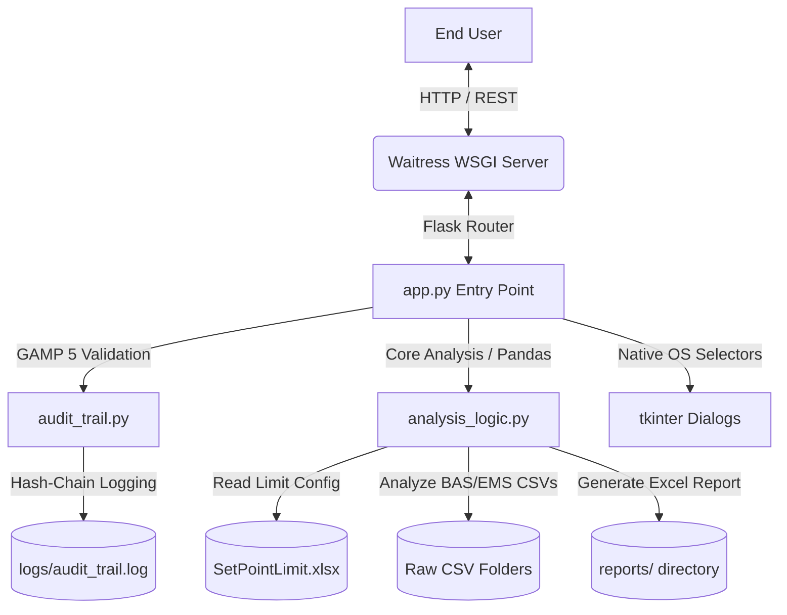
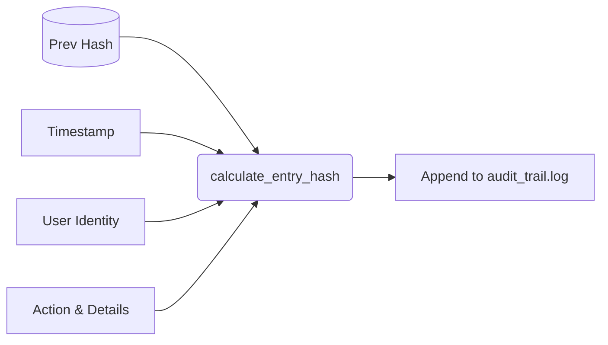

# CODEBASE GRAPH: AirQualityReview_Project

## 1. Core Architecture

The **Air Quality Review (AQR) System** is a GAMP 5 compliant, standalone desktop application built on a hybrid Flask-desktop architecture. It is designed to ingest raw BAS (Building Automation System) and EMS (Environmental Monitoring System) reports, clean the data using Pandas, analyze violations for temperature, humidity, and relative room pressure, and produce validated Excel reports and interactive visualization charts.

### Tech Stack Overview
*   **Backend**: Python 3.7+, Flask (REST Controller), Pandas & Openpyxl (Data Engine), Waitress (WSGI Server).
*   **Frontend**: Vanilla HTML5, CSS3 (Modern Glassmorphism Design System), JavaScript (ES6+).
*   **Build/Deployment**: PyInstaller for packaging into a single `.exe` binary.

---

## 2. Main Entry Points & DNA Analysis

### `app.py`
The main runtime controller. Handles system lifecycle, Flask routing, SSE thread management, and native OS interop.
*   **Path Persistence Refactoring**: Uses `getattr(sys, 'frozen', False)` to discover runtime resources (`_MEIPASS`) dynamically when packaged as an executable.
*   **Tkinter Picker Native Interop**: Spawns short-lived hidden Tkinter root windows (`create_hidden_tk_root`) to display OS-native file and directory select boxes on top of the browser.
*   **SSE Log Streaming Engine**: Spawns background worker threads for `analyze_files` and streams stdout logs to the frontend via an SSE stream (`/stream/<job_id>`) utilizing the custom `QueueWriter` buffer class.

### `analysis_logic.py`
The core computational engine. Ingests, processes, and evaluates sensor limits.
*   **The Previous-Day Hack**: Includes `_parse_filename_for_datetime` which subtracts 1 day (`parsed_dt - pd.Timedelta(days=1)`) from the filename timestamp, adhering to legacy business rules where BAS reports represent the preceding day's logging.
*   **Strict Temporal Alignment**: Resolves multi-room relative pressure corridor comparisons via `pd.merge_asof` with a strict `60s` tolerance mapping.
*   **Data Continuity Constraints**: Employs `diff(5).dt.total_seconds() == 1500` to find exactly 6 consecutive points (25 minutes continuous) spaced exactly 5 minutes apart, complying with GxP violation window criteria.

---

## 3. Pattern Discovery & Component Graph

### GAMP 5 Tamper-Evident Audit Trail (`audit_trail.py`)
Maintains a strict, cryptographically linked append-only event log to satisfy GxP data integrity regulations.
*   **SHA-256 Hash Chain**: Each log entry is cryptographically linked to the previous entry:
    $$\text{entry\_hash} = \text{SHA256}(\text{timestamp} \parallel \text{user} \parallel \text{action} \parallel \text{prev\_hash})$$
*   **Startup Verification**: System runs `verify_audit_trail()` on start. If the hash chain is broken or tampered with, it displays a fatal GUI message (`Fatal Error 004`) and halts immediately (`sys.exit(1)`).

### Room Prefix Routing Regex Mappings
Used in `app.py` to identify room types and parse their point configurations dynamically:
*   **Main Plant**: `re.search(r'([12]-P\d{3})', point_name)` $\rightarrow$ matches format `1-P036`.
*   **Module 5**: `re.search(r'([12]P\d{3})', point_name)` $\rightarrow$ matches format `1P036`.
*   **Pilot Plant**: `re.search(r'(\dS\d{3})', point_name)` $\rightarrow$ matches format `2S015`.

### State Management & Concurrency
*   **Background Jobs Storage**: Uses the thread-safe `_jobs` dictionary (`job_id -> {queue, done, response, plot, error}`) guarded by `_jobs_lock`.
*   **Single active analysis constraint**: Regulated by `_analysis_lock` which restricts execution to one concurrent analysis, preventing overlapping stdout capture stream corruption and raising `429 Too Many Requests` on double-clicks.

---

## 4. Technical Constraints & Risks

> [!IMPORTANT]
> **1. CDN Dependency in Air-Gapped Environments**
> *   *Constraint*: FontAwesome, Plotly.js, and Google Fonts (Inter, JetBrains Mono) are loaded from external CDNs.
> *   *Risk*: AQR is built to run standalone offline. If used on isolated validation PCs without internet access, charts will fail to load, and icons will show as blank squares.
> *   *Recommendation*: Bundle static assets local to the `static/` directory and configure the PyInstaller Spec to bundle them.

> [!WARNING]
> **2. Waitress WSGI SSE Thread Starvation**
> *   *Constraint*: Waitress WSGI is configured with `threads=8` and `channel_timeout=3600`.
> *   *Risk*: Every open SSE log stream `/stream/<job_id>` holds a Waitress client thread open until completion. If 8 users/tabs concurrently open the dashboard stream, the web server will starve and freeze, refusing new HTTP requests.

> [!CAUTION]
> **3. Temporal File Parsing Vulnerabilities**
> *   *Constraint*: Relies strictly on the `[ROOM]_[MM-DD-YY]_[HH-MM].csv` format to perform initial UI date-filtering.
> *   *Risk*: If raw filenames deviate slightly (e.g., single-digit days, different hyphenation), date boundaries parse as `None`, causing analysis to crash or ignore valid files.
