# Air Quality Review (AQR) System
## Standard Operating Procedure (SOP) & User Manual
**Document Reference: SOP-AQR-001**  
**GAMP 5 Software Category: Category 5 (Custom Applications / Bespoke Software)**  
**Validated Data Analytics for Industrial Environmental Compliance**  
**Version: 1.1.0**  

---

## Document Control & Revision History

| Version | Date | Author | Reviewer / Role | Approver / Role | Description of Changes |
| :--- | :--- | :--- | :--- | :--- | :--- |
| **1.0.0** | 2026-05-15 | System Architect | QA Validation Manager | QA Director | Initial release under GAMP 5 Category 4 guidelines. |
| **1.1.0** | 2026-05-20 | Lead Software Engineer | Lead Validator | QA Director | Re-classified to GAMP 5 Category 5, updated to 20-Minute Deviation Rule, added recursive EMS scanning, documented manual BAS Phase I transformation guide, and converted to sequential bilingual format. |

---

## 1. Scope & Compliance Objectives
## 1. วัตถุประสงค์และขอบเขตการกำกับดูแล

The **Air Quality Review (AQR) System** is a GAMP 5 Category 5 compliant software designed to automate the ingestion, validation, alignment, and analysis of environmental monitoring data. The system reads Building Automation System (BAS - Phase I) and Environmental Monitoring System (EMS - Phase II) records to evaluate compliance for Temperature (°C), Relative Humidity (%RH), and Differential Room Pressure (Pa) across cleanroom environments.
ระบบ **Air Quality Review (AQR)** เป็นซอฟต์แวร์ที่สอดคล้องตามมาตรฐาน GAMP 5 ประเภทที่ 5 (Category 5) ได้รับการออกแบบขึ้นเพื่อลดขั้นตอนการป้อนข้อมูล การตรวจสอบความถูกต้อง การประสานข้อมูล และการวิเคราะห์ข้อมูลการตรวจสอบสภาพแวดล้อมโดยอัตโนมัติ ระบบจะอ่านบันทึกข้อมูลจากระบบการจัดการอาคาร (BAS - Phase I) และระบบตรวจสอบสภาพแวดล้อม (EMS - Phase II) เพื่อประเมินความสอดคล้องของค่าอุณหภูมิ (°C) ความชื้นสัมพัทธ์ (%RH) และความดันต่างของห้อง (Pa) ในพื้นที่สะอาด (Cleanroom)

### Data Integrity & Regulatory Objectives
### ความสมบูรณ์ของข้อมูลและเป้าหมายการควบคุมด้านกฎระเบียบ

1. **GxP Validation Compliance**: Enforces strict, immutable calculations of environmental limits to satisfy international regulatory standards (WHO, PIC/S, FDA).
การปฏิบัติตามมาตรฐาน GxP: บังคับใช้การคำนวณที่เข้มงวดและไม่สามารถแก้ไขได้ของขีดจำกัดสภาพแวดล้อม เพื่อให้เป็นไปตามมาตรฐานการควบคุมสากล (WHO, PIC/S, FDA)

2. **Tamper-Evident Logs (ALCOA+)**: Implements cryptographically chain-linked audit trails preventing data modification and ensuring complete traceability.
บันทึกประวัติการใช้งานที่ป้องกันการปลอมแปลง (ALCOA+): การนำบันทึกประวัติการใช้งาน (Audit Trail) ที่เชื่อมโยงกันด้วยรหัสเข้ารหัสลับ (Cryptographic Chain-Link) มาใช้ป้องกันการดัดแปลงข้อมูลและรับรองความสามารถในการตรวจสอบย้อนกลับได้อย่างสมบูรณ์

3. **Algorithmic Verification**: Ensures zero human-error margins in calculating violation continuous windows (more than 20-minute rule) and corridor-room pressure differentials across EU GMP cleanroom grades.
การตรวจสอบด้วยอัลกอริทึม: รับรองว่าความคลาดเคลื่อนจากความผิดพลาดของมนุษย์จะเป็นศูนย์ในการคำนวณช่วงเวลาการเบี่ยงเบนอย่างต่อเนื่อง (กฎมากกว่า 20 นาที) และความดันต่างระหว่างทางเดินและห้องสะอาดตามเกณฑ์เกรดพื้นที่สะอาด EU GMP

---

## 2. Installation & System Launch Setup
## 2. การติดตั้งระบบและการเปิดใช้งานโปรแกรม

### 2.1 Software Prerequisites
### 2.1 ข้อกำหนดเบื้องต้นด้านซอฟต์แวร์

For standard execution via the packaged standalone binary, ensure the following target operating environment is met on the client workstation:
สำหรับการใช้งานมาตรฐานผ่านโปรแกรมที่คอมไพล์สำเร็จรูป (Standalone Binary) โปรดตรวจสอบให้แน่ใจว่าเครื่องคอมพิวเตอร์ที่ปฏิบัติงานมีคุณสมบัติตรงตามสภาพแวดล้อมดังต่อไปนี้:

* **Operating System**: Windows 10 / Windows 11 (64-bit).
ระบบปฏิบัติการ: Windows 10 / Windows 11 (ระบบ 64 บิต)

* **Microsoft VC++ Redistributable (x64)**: This component must be installed on the host PC. Lack of this redistributable results in a `Failed to load Python DLL` startup error.
Microsoft VC++ Redistributable (x64): ส่วนประกอบนี้จำเป็นต้องได้รับการติดตั้งบนคอมพิวเตอร์ หากไม่มีส่วนประกอบนี้จะส่งผลให้เกิดข้อผิดพลาด `Failed to load Python DLL` เมื่อเปิดโปรแกรม

* **Local Port Availability**: Port `5000` must not be bound to other system services.
การใช้งานพอร์ตระบบ: พอร์ต `5000` ของเครื่องต้องไม่ถูกใช้งานโดยบริการระบบอื่นๆ

### 2.2 Standard Target Folder Structure
### 2.2 โครงสร้างโฟลเดอร์ปฏิบัติงานมาตรฐาน

The application requires specific directory folders in its execution path to maintain directory structure invariants:
ตัวโปรแกรมต้องการโฟลเดอร์เฉพาะในตำแหน่งที่ติดตั้งเพื่อรักษาความถูกต้องของโครงสร้างระบบไฟล์:

```
AirQualityReview/
├── AQR_Dashboard_v1.1.0.exe               # Packaged single standalone binary
├── reports/              # Target folder where Excel reports are written (Auto-created)
└── logs/                 # Folder containing GAMP 5 audit trail logs (Auto-created)
```

> [!IMPORTANT]
> **Regulatory Notice**: The `logs/audit_trail.log` file must not be modified, deleted, or moved. The system will perform an integrity check of the log file's cryptographic hash chain on startup. If a mismatch is detected, execution halts immediately.
> ข้อกำหนดทางกฎระเบียบ: ห้ามแก้ไข ลบ หรือย้ายไฟล์ `logs/audit_trail.log` โดยเด็ดขาด ระบบจะดำเนินการตรวจสอบความสมบูรณ์ของสายโซ่รหัสแฮช (Cryptographic Hash Chain) ของไฟล์บันทึกนี้ทุกครั้งเมื่อเปิดโปรแกรม หากพบสิ่งผิดปกติ โปรแกรมจะหยุดทำงานทันที

### 2.3 Starting the Application
### 2.3 ขั้นตอนการเปิดใช้งานโปรแกรม

1. Navigate to the directory containing `AQR_Dashboard_v1.1.0.exe`.
เปิดเข้าไปยังโฟลเดอร์ที่มีไฟล์ `AQR_Dashboard_v1.1.0.exe` อยู่

2. Double-click `AQR_Dashboard_v1.1.0.exe` (or execute `python app.py` if running in development mode).
ดับเบิ้ลคลิกที่ไฟล์ `AQR_Dashboard_v1.1.0.exe` (หรือรันคำสั่ง `python app.py` หากรันในโหมดนักพัฒนา)

3. A console background worker launches. Within 5–15 seconds, your default web browser opens automatically to:
    `http://127.0.0.1:5000/aqr`
หน้าต่างคอนโซลจำลองการทำงานเบื้องหลังจะเปิดขึ้น จากนั้นภายในเวลา 5–15 วินาที เบราว์เซอร์เริ่มต้นของเครื่องจะเปิดขึ้นโดยอัตโนมัติไปยังที่อยู่: `http://127.0.0.1:5000/aqr`

---

## 3. Step-by-Step Dashboard Operations & Navigation
## 3. คู่มือขั้นตอนปฏิบัติงานและการใช้งานหน้าจอหลัก

This section details the explicit user interface navigation. It explains which buttons to click, the fields present, and the operational behavior of each screen.
ส่วนนี้อธิบายรายละเอียดเกี่ยวกับขั้นตอนการใช้งานหน้าจออย่างละเอียด โดยระบุว่าต้องคลิกปุ่มใด ฟิลด์ข้อมูลต่างๆ หมายถึงอะไร และลักษณะการทำงานของแต่ละหน้าจอ

### 3.1 Main Air Quality Review Dashboard (`/aqr`)
### 3.1 หน้าจอหลักระบบทบทวนคุณภาพอากาศ (`/aqr`)

```
======================================================================================
[ AIR QUALITY REVIEW SYSTEM (AQR) v1.1.0 ]                             [TRANSFORM]
======================================================================================
  CONFIGURATION SIDEBAR                    |  ROOM & AREA SELECTOR
                                           |  
  1. Source Mode Selector:                 |  [ AREA: AHU-01 ] [ Select All ] [ Clear All ]
     [x] Phase I (BAS)  [ ] Phase II (EMS) |  
                                           |  [x] Room 1-P038  [ Dispensing Room A ]
  2. Select Data Source Folder:            |  [x] Room 1-P039  [ Dispensing Room B ]
     [ D:/Data/Raw_CSVs               ]    |  [ ] Room 1-P040  [ Sampling Room ]
     Button: [ Browse ]                    |  
                                           |  ------------------------------------------------
  3. Select SetPoint Limit File:           |  [ Generate Summary Reports ]
     [ D:/Limits/SetPointLimit.xlsx   ]    |  
     Button: [ Browse ]                    |  ------------------------------------------------
                                           |  AQR PROGRAM DETAILED ANALYSIS LOG (SSE TERMINAL)
  4. Define Date-Time Range:               |  [ 09:34:12 ] [INFO] System initialized.
     Start: [ 2026-05-19 00:00 ]           |  [ 09:34:15 ] [INFO] Loaded limits for 150 rooms.
     End:   [ 2026-05-20 00:00 ]           |  [ 09:34:20 ] [INFO] Processing Room: 1-P038...
                                           |  [ 09:34:22 ] [INFO] Completed Room: 1-P038
  5. Action:                               |  [ 09:34:25 ] [Done] Report written.
     Button: [ Scan & Load Available Rooms ] |  
                                           |  [ Download AQR Program Report ]  [ Generate Visual Graphs ]
======================================================================================
```

#### Step 3.1.1: Configuration Sidebar Layout & Field Meanings
#### ขั้นตอน 3.1.1: การกำหนดค่าในแถบควบคุมด้านข้างและความหมายของแต่ละฟิลด์

##### 1. Source Mode Selector (Toggle Control)
##### 1. ตัวเลือกโหมดข้อมูล (Source Mode Selector)
To switch the background ingestion engine between BAS flat-file parsing and EMS folder-tree parsing, select the radio option for **Phase I (BAS)** or **Phase II (EMS)** depending on the environmental data source. Clicking this option configures critical backend parameters including input delimiters (comma `,` vs semicolon `;`), scientific notation parsing, and the directory traversal strategy.
การเลือกโหมดข้อมูลดิบเพื่อปรับลักษณะการสแกนและประมวลผลทำได้โดยคลิกเลือกตัวเลือก **Phase I (BAS)** หรือ **Phase II (EMS)** ตามแหล่งที่มาของข้อมูลสภาพแวดล้อมที่แท้จริง ซึ่งระบบจะดำเนินการสลับกลไกควบคุมเบื้องหลังโดยอัตโนมัติในการกำหนดสัญลักษณ์แบ่งคอลัมน์ (เครื่องหมายจุลภาค `,` สำหรับ BAS หรือเครื่องหมายอัฒภาค `;` สำหรับ EMS) พร้อมตั้งค่าการประมวลผลสัญกรณ์วิทยาศาสตร์และการสแกนโฟลเดอร์ตามเป้าหมาย

##### 2. Raw CSV Folder Selector (Browse Control)
##### 2. ตัวเลือกโฟลเดอร์ไฟล์ข้อมูลดิบ (Raw CSV Folder Selector)
Define the source directory containing raw sensor data logs by clicking the **Browse** button. This opens the operating system's directory selection window where you can select the target folder and click **OK**. The absolute path to the directory (e.g., `D:/ex_work/AirQualityReview_Project/data/C`) is then displayed in the input field. Because the backend engine features a recursive scanning logic, it will search all nested subfolders automatically, allowing the operator to simply select the top-level directory without manually preparing subdirectories.
กำหนดโฟลเดอร์แหล่งข้อมูลดิบเซ็นเซอร์โดยคลิกปุ่ม **Browse** เพื่อเปิดหน้าต่างเลือกโฟลเดอร์ของระบบปฏิบัติการ ให้ผู้ใช้งานคลิกเลือกโฟลเดอร์หลักที่เก็บไฟล์ข้อมูลที่ต้องการประมวลผลแล้วกด **OK** โดยที่อยู่สมบูรณ์ของโฟลเดอร์ (เช่น `D:/ex_work/AirQualityReview_Project/data/C`) จะปรากฏขึ้นในช่องข้อมูลทันที ระบบนี้มาพร้อมเทคโนโลยีค้นหาโฟลเดอร์ย่อยแบบวนซ้ำ (Recursive Ingestion Scan) ซึ่งจะตรวจจับและดึงข้อมูลไฟล์ CSV ของทุกโฟลเดอร์ที่ซ้อนอยู่ภายในโดยอัตโนมัติ ช่วยลดความยุ่งยากให้ผู้ปฏิบัติงานเลือกเพียงเฉพาะโฟลเดอร์หลักชั้นบนสุดเท่านั้น

##### 3. SetPoint Limit File Selector (File Browse Control)
##### 3. ตัวเลือกไฟล์ควบคุมข้อกำหนด URS (SetPoint Limit File Selector)
Select the reference configuration spreadsheet containing the sensor warning limits (URS) for each room by clicking the **Browse** button. In the file selection dialog that opens, select the appropriate spreadsheet (`SetPointLimit.xlsx` for Phase I or `SetPointLimit_Phase2.xlsx` for Phase II) and click **Open** to display the absolute path (e.g., `D:/ex_work/AirQualityReview_Project/data/SetPointLimit.xlsx`) in the field. In accordance with GxP custom application criteria, the engine evaluates compliance strictly against the limits defined inside this Excel file. The operator must ensure that the selected limit sheet reflects the latest validated URS limits for each specific zone, regardless of pre-configured reference examples (e.g., Temperature ≤ 25.0°C, Humidity 35.0% - 65.0%RH, and Pressure differences at 15, 30, 45, 60 Pa).
เลือกนำเข้าไฟล์สเปรดชีต Excel ขีดจำกัด URS อ้างอิงของแต่ละพื้นที่โดยคลิกปุ่ม **Browse** จากนั้นบนหน้าต่างเลือกไฟล์ของระบบปฏิบัติการ ให้ทำการเลือกไฟล์สเปรดชีตขีดจำกัดระบบควบคุมที่ต้องการ (`SetPointLimit.xlsx` สำหรับ Phase I หรือ `SetPointLimit_Phase2.xlsx` สำหรับ Phase II) แล้วคลิก **Open** เพื่อแสดงที่อยู่ไฟล์แบบเต็ม (เช่น `D:/ex_work/AirQualityReview_Project/data/SetPointLimit.xlsx`) ในช่องแสดงข้อมูล ทั้งนี้เพื่อให้เป็นไปตามกฎระเบียบ GxP สำหรับระบบประเภทปรับแต่งพิเศษ อัลกอริทึมวิเคราะห์จะประมวลผลเกณฑ์ผ่าน-ตกบนข้อมูลดิบอ้างอิงตรงตามค่าลิมิตที่ระบุไว้ภายในไฟล์ Excel นี้ร้อยเปอร์เซ็นต์ ผู้ปฏิบัติงานจึงต้องตรวจสอบให้แน่ใจว่าไฟล์สเปรดชีตดังกล่าวระบุเกณฑ์ URS ที่ตรงตามเอกสารประเมินอย่างเป็นทางการของแต่ละห้องปฏิบัติการ

##### 4. Define Date-Time Range (Temporal Input Fields)
##### 4. กำหนดช่วงเวลาการทบทวน (Define Date-Time Range)
Control the exact start and end boundaries for the validation analysis using the integrated date-time calendar pickers. You can type directly in the fields or click the calendar icon to specify the **Start Date/Time** and **End Date/Time** in the format `YYYY-MM-DD HH:MM`. To expedite operation and minimize human data-entry errors, the system features an Auto-Population mechanism that scans the selected folder's files first and automatically pre-fills these fields with the earliest and latest timestamps detected in the raw data files.
กำหนดห้วงกรอบวันเวลาสำหรับใช้วิเคราะห์ตรวจสอบความสอดคล้องของข้อมูลสภาพแวดล้อมผ่านช่องปฏิทินหน้าจอ โดยผู้ปฏิบัติงานสามารถคีย์ป้อนข้อมูลวันที่ลงในกล่องข้อความโดยตรง หรือคลิกรูปสัญลักษณ์ปฏิทินเพื่อทำรายการเลือก **วันเวลาเริ่มต้น (Start Date/Time)** และ **วันเวลาสิ้นสุด (End Date/Time)** ในรูปแบบสากล `YYYY-MM-DD HH:MM` ทั้งนี้ตัวระบบมีเทคโนโลยีตรวจจับความยาวชุดข้อมูลอัตโนมัติ (Auto-Population) ซึ่งเมื่อสั่งสแกนระบุตำแหน่งไฟล์ ระบบจะดึงเอาเวลาจุดแรกและจุดสุดท้ายที่อยู่ในไฟล์ข้อมูลดิบเหล่านั้นมาตั้งค่าระบุช่องเวลาเริ่มต้นและสิ้นสุดไว้ให้โดยอัตโนมัติ ช่วยป้องกันความผิดพลาดและอำนวยความสะดวกสูงสุด

##### 5. Scan & Load Available Rooms Button (Action Control)
##### 5. ปุ่มสแกนค้นหารายชื่อห้องที่มีข้อมูล (Scan & Load Available Rooms)
Click the Indigo-Blue **Scan & Load Available Rooms** button to instruct the system to read your selected SetPoint spreadsheet and cross-reference it with the discovered CSV files to identify valid Room IDs active during the defined date-time range. A loading spinner will display briefly on the interface while processing, and then the system will load the **Room & Area Selector Panel** on the right with all eligible locations grouped neatly by their functional cleanroom Area (e.g., Grade A, Grade B, Module 1, AHU-01).
สั่งเริ่มสแกนตรวจสอบเพื่อรวบรวมรายชื่อห้องปฏิบัติการสะอาดทั้งหมดโดยคลิกปุ่มสีน้ำเงินคราม **Scan & Load Available Rooms** เพื่อระบบจะไปดึงเกณฑ์ขีดจำกัดจากสเปรดชีต Excel มาเปรียบเทียบหาความสอดคล้องกับไฟล์ข้อมูลดิบในช่วงระยะเวลาทบทวนที่ผู้ใช้งานเลือก โดยในระหว่างคำนวณหน้าจอจะขึ้นไอคอนสปินเนอร์หมุนดาวน์โหลดชั่วคราว จากนั้นระบบจะทำการป้อนข้อมูลและเปิดการแสดงผลรายชื่อห้องปฏิบัติการที่ถูกต้องลงใน **Room & Area Selector Panel** ทางฝั่งขวา โดยจัดแยกเป็นกลุ่มๆ ตามเกรดมาตรฐานหรือกลุ่มพื้นที่ควบคุมแรงดันลมอ้างอิง (เช่น Grade A, Grade B, Module 1, AHU-01)


---

#### Step 3.1.2: Sidebar Menu & Utility Controls
#### ขั้นตอน 3.1.2: แผงเมนูด้านข้างและระบบควบคุมยูทิลิตี้ช่วยเหลือ

Refer to **Figure 1** (Initial Dashboard UI State) above to visualize the sidebar menu layout and components.
โปรดอ้างอิง **Figure 1** (Initial Dashboard UI State) ด้านบนเพื่อดูการจัดวางโครงสร้างและองค์ประกอบของแผงเมนูแถบด้านข้างหลัก

Located at the top and left sidebar pane of the web client, these utility links provide critical diagnostic information, session management, and application termination tools:
แถบลิงก์ช่วยเหลือที่อยู่ด้านบนและด้านล่างของแผงควบคุมหลัก มีไว้สำหรับเรียกดูข้อมูลการวินิจฉัย การจัดการเซสชัน และปุ่มสำหรับการสั่งปิดระบบโปรแกรม:

##### 1. Information Panel (`javascript:showInfoModal()`)
##### 1. หน้าต่างคำอธิบายข้อมูลระบบ (Information Panel)
Click the **Info** or help link located in the application header to open a modal window displaying the GAMP 5 software validation summary and cGMP operational workflow overview. Once reviewed, click the **Close** button at the bottom of the dialog window to return to the active main dashboard.
ให้ผู้ทบทวนคลิกที่คำว่า **Info** หรือสัญลักษณ์ลิงก์ช่วยเหลือบริเวณแถบหัวข้อเพื่อเปิดหน้าต่างแสดงข้อมูลภาพรวมการประเมินความสอดคล้องตามเกณฑ์ GAMP 5 และคำอธิบายขั้นตอนการดำเนินงานมาตรฐานสำหรับกระบวนการ cGMP และเมื่ออ่านเสร็จเรียบร้อย ให้กดปุ่ม **Close** ด้านล่างสุดเพื่อปิดหน้าต่างแสดงข้อมูลดังกล่าวและกลับสู่หน้าจอปฏิบัติงานหลักทันที

##### 2. About Panel (`javascript:showAboutModal()`)
##### 2. หน้าต่างเกี่ยวกับโปรแกรมและผู้พัฒนา (About Panel)
Click the **About** navigation link to open the system identity modal which lists software versioning metadata, developer information, and the cryptographic details of the secure audit trail mechanism. Click the green **Close** button to close the modal.
เปิดดูข้อมูลเวอร์ชันโดยคลิกที่คำสั่ง **About** ระบบจะแสดงข้อมูลจำเพาะเชิงกฎหมายของซอฟต์แวร์ รวมถึงแนวทางการคุ้มครองรหัสสายโซ่ความปลอดภัยของประวัติระบบควบคุม (Audit Trail Cryptographic Chain-Link) และสามารถกดปุ่มสีเขียว **Close** เพื่อปิดและออกกลับสู่หน้าจอการทำงานปกติ

##### 3. Reset Application (`javascript:location.reload()`)
##### 3. ล้างเซสชันและรีเซ็ตโปรแกรม (Reset Application)
Perform a complete client-side session reset by clicking the **Reset Application** button in the sidebar navigation panel, which instantly reloads the web page to clear all currently entered path fields, dates, and selected room selections.
ล้างค่าและเตรียมพร้อมหน้าจอปฏิบัติการใหม่โดยคลิกเลือกเมนู **Reset Application** บนแผงแถบเมนูด้านซ้าย หน้าเบราว์เซอร์จะทำการรีโหลดหน้าเพจอย่างรวดเร็วและลบค่าอินพุตที่บันทึกค้างไว้รวมถึงห้องปฏิบัติการที่เลือกไว้ทิ้ง เพื่อเริ่มต้นการทำงานใหม่ในรูปแบบของเซสชันข้อมูลที่สะอาดไร้รอยต่อ

##### 4. Close Application (`javascript:shutdownApp()`)
##### 4. การปิดโปรแกรม (Close Application)
To securely terminate the application worker process and shut down the background Flask server (which frees local port 5000), click the **Close Application** option and then click **OK** on the browser's confirmation dialog window to exit.
สำหรับการสั่งปิดการทำงานโปรแกรมโดยสมบูรณ์ ให้คลิกเมนู **Close Application** และกด **OK** บนกล่องเตือนยืนยันของเบราว์เซอร์ ระบบหลังบ้านจะทำการส่งชุดคำสั่งยุติการรันบริการของ Flask Server ทันที คืนทรัพยากรการใช้งานพอร์ต 5000 ของตัวเครื่อง และปิดหน้าต่างควบคุมเบราว์เซอร์ลงอย่างรวดเร็วและเป็นระเบียบภายในเวลา 1 วินาที

---

#### Step 3.1.3: Room & Area Selection Panel
#### ขั้นตอน 3.1.3: แผงตัวเลือกรายชื่อห้องและกลุ่มพื้นที่

* **User Navigation**: Use the area dropdown checkboxes to filter rooms by area groupings.
การนำทางของผู้ใช้: ใช้เมนูตัวกรองเลือกตามกลุ่มพื้นที่เพื่อแยกดูรายชื่อห้องเฉพาะกลุ่มที่ต้องการ

* **Select All / Deselect All Controls**: Click these buttons to select or clear all checkboxes in the active view.
ปุ่มเลือกทั้งหมด/ล้างทั้งหมด: คลิกปุ่มเหล่านี่เพื่อสั่งเช็คถูกทุกช่อง หรือยกเลิกเช็คถูกทุกช่องในแถบแสดงผลอย่างรวดเร็ว

* **Individual Room Checkboxes**: Review the unique `Room ID` and corresponding `Room Name` from the sheet. Check the specific rooms you are authorized or tasked to audit.
ช่องเลือกรายห้อง: ตรวจสอบหมายเลขห้องและชื่อห้องที่แสดงตรงตามเอกสาร จากนั้นทำเครื่องหมายเช็คถูกหน้าห้องเฉพาะเจาะจงที่ผู้ทบทวนได้รับมอบหมายให้ทำการสแกนประเมินความสอดคล้อง


---

#### Step 3.1.4: Executing the Ingestion & Review (Generate Summary Reports)
#### ขั้นตอน 3.1.4: การสั่งรันโปรแกรมเพื่อดำเนินการวิเคราะห์ (Generate Summary Reports)

1. Verify the sidebar parameters and checked rooms are correct.
ตรวจสอบยืนยันข้อมูลและพารามิเตอร์ด้านซ้าย รวมถึงช่องทำเครื่องหมายหน้าห้องที่ต้องการวิเคราะห์ว่าถูกต้องครบถ้วน

2. Click the Indigo-Blue **[ Generate Summary Reports ]** button.
คลิกปุ่มสีน้ำเงินครามคำว่า **[ Generate Summary Reports ]**

3. The system immediately acquires `_analysis_lock` on the backend, spawns an asynchronous analytical background thread, and streams live console logs to the interface.
ระบบจะเข้าสิทธิ์ล็อกการทำงานบนระบบหลังบ้านเบื้องหลังเพื่อความปลอดภัย สปอนเธรดคำนวณแยกต่างหากเพื่อป้องกันโปรแกรมค้าง และส่งข้อมูลการประมวลผลแบบเรียลไทม์ผ่าน SSE (Server-Sent Events) มาแสดงบนกล่องคอนโซลจำลองหน้าจอ

* *Live Logging Safety*: The console terminal utilizes `requestAnimationFrame` to limit DOM flushes to 60 FPS. This prevents browser freeze or high memory spikes when processing massive logs.
ระบบคอนโซลประมวลผลปลอดภัย: กล่องคอนโซลใช้เทคนิคควบคุมความถี่ในการวาดข้อมูลลงจอไม่เกิน 60 FPS ป้องกันการที่เว็บบนเบราว์เซอร์จะหยุดนิ่งหรือกินทรัพยากรเครื่องสูงเมื่อต้องโหลดข้อมูลบรรทัดรายงานปริมาณมหาศาล


---

#### Step 3.1.5: Downloading the Immutable Report
#### ขั้นตอน 3.1.5: การดาวน์โหลดเอกสารรายงานที่ไม่สามารถแก้ไขได้

* Upon analysis completion, the log terminal prints `[Done] Report written: AQR_Report_YYYYMMDD_HHMMSS.xlsx`.
เมื่อการประมวลผลสิ้นสุดลงอย่างสมบูรณ์ กล่องรายงานด้านล่างจะขึ้นข้อความ `[Done] Report written: AQR_Report_YYYYMMDD_HHMMSS.xlsx`

* The Indigo-Blue **[ Download AQR Program Report ]** button is activated.
ปุ่มดาวน์โหลดรายงานสีน้ำเงินคราม **[ Download AQR Program Report ]** จะสว่างขึ้นพร้อมใช้งาน

Once active, click the Indigo-Blue **[ Download AQR Program Report ]** button to download the finalized compliance spreadsheet from `/download/<filename>` directly to your computer.
เมื่อตัวปุ่มควบคุมสีน้ำเงินครามคำว่า **[ Download AQR Program Report ]** สว่างขึ้นพร้อมใช้งานแล้ว ให้ผู้ทบทวนคลิกปุ่ม **[ Download AQR Program Report ]** นี้ทันทีเพื่อดาวน์โหลดและบันทึกสเปรดชีตผลการสแกนทบทวนสภาพแวดล้อมอย่างเป็นทางการลงสู่ระบบเครื่องคอมพิวเตอร์ผ่านทางเบราว์เซอร์จากที่อยู่สิทธิ์เข้าถึงเฉพาะ `/download/<filename>`

##### Structure of the Generated Excel Report:
##### โครงสร้างของไฟล์เอกสารรายงาน Excel ที่ผ่านการคำนวณสอดคล้องเกณฑ์ระบบ:
* **Top Row**: Contains Period analyzed, Software version and Timestamp of Generation.
ส่วนหัวรายงาน: ประกอบด้วยช่วงวันเวลาที่วิเคราะห์ เวอร์ชันของซอฟต์แวร์ และเวลาที่สร้างเอกสารรายงานอย่างเป็นทางการ

* **Date Group Separator Rows**: Printed light-gray date banner row (`DATE: YYYY-MM-DD`) for every calendar date evaluated.
บรรทัดคั่นวันที่จัดกลุ่ม: ระบบจะสร้างแถบแบนเนอร์สีเทาอ่อนระบุวันที่คั่นข้อมูลเพื่อให้อ่านง่ายและแบ่งกลุ่มการตรวจสอบเป็นรายวันปฏิทิน

* **Data Columns**:
คอลัมน์แสดงรายงานรายละเอียด:
    1. `Room no.` (e.g., `1-P038`) - Left Aligned. (หมายเลขห้อง ชิดซ้าย)
    2. `Room name` (e.g., `Dispensing Room A`) - Left Aligned. (ชื่อห้อง ชิดซ้าย)
    3. `Specification` - Details the specific limits tested (e.g., `Temperature: ≤ 25.0 °C \n Humidity: 35 - 65 %RH \n Pressure: 15 - 30 Pa`).
    (รายละเอียด URS ขีดจำกัดเฉพาะของห้องนั้น เช่น อุณหภูมิไม่เกิน 25.0 °C ความชื้น 35 - 65 %RH)
    4. `Analysis results` - Immutably documents compliance status (refer to Section 3.1.5.1 for detailed definitions):
    (ผลการประเมินวิเคราะห์: แสดงผลความสอดคล้องของข้อมูลแบบถาวรโดยระบบ โดยสามารถศึกษาคำจำกัดความอย่างละเอียดในส่วนที่ 3.1.5.1)
        * `Passed`: Clean records or transient spikes filtered out. ( Passed - บันทึกผลผ่านเกณฑ์เมื่อไม่มีการเบี่ยงเบนต่อเนื่องเกินกำหนด)
        * `Out of spec`: Detailed excursion times and peak values. ( Out of spec - บันทึกเหตุการณ์นอกเกณฑ์ขีดจำกัดพร้อมเวลาเริ่มต้น สิ้นสุด และค่าสูงสุด)
        * `Data Loss`: Missing data and NaN sensor disconnects. ( Data Loss - บันทึกเหตุการณ์ข้อมูลเซ็นเซอร์สูญหายหรือพบค่าว่าง)
        * `Out of spec & Data Loss`: Concurrent violations and missing data. ( Out of spec & Data Loss - บันทึกเหตุการณ์ที่พบนอกเกณฑ์และข้อมูลสูญหายร่วมกันในวันนั้น)
        * `N/A`: No limits or sensors configured in Setpoint spreadsheet. ( N/A - ไม่มีการกำหนดขีดจำกัดหรือเซ็นเซอร์ในห้องนั้นๆ)

---

#### 3.1.5.1 Environmental Parameters & Compliance Status Reference Guide
#### 3.1.5.1 คู่มืออ้างอิงพารามิเตอร์สิ่งแวดล้อมและสถานะการตรวจสอบความสอดคล้อง

```
===================================================================================================
                                  COMPLIANCE STATUS DECISION TABLE
===================================================================================================
  Sensor Status   |   OOS Violation Duration   |   Configured Limit   |  Resulting Excel Status
---------------------------------------------------------------------------------------------------
  All Valid (Num) |   0 Continuous Minutes     |   Configured (URS)   |  Passed
  All Valid (Num) |   > 20 Continuous Minutes  |   Configured (URS)   |  Out of spec
  NaN Detected    |   N/A                      |   Configured (URS)   |  Data Loss
  NaN & OOS both  |   > 20 Continuous Minutes  |   Configured (URS)   |  Out of spec & Data Loss
  Valid/NaN       |   N/A                      |   Not Configured     |  N/A
===================================================================================================
```

##### A. Environmental Parameters Overview
##### ก. ภาพรวมพารามิเตอร์ควบคุมด้านสิ่งแวดล้อม
To satisfy GPO Rangsit cleanroom manufacturing requirements (WHO GMP/PIC/S Grade A, B, C, D), three critical environmental parameters are monitored and evaluated:
เพื่อตอบสนองข้อกำหนดการผลิตในพื้นที่สะอาดของโรงงาน GPO รังสิต (เกรดความสะอาด Grade A, B, C, D ตามมาตรฐาน WHO GMP และ PIC/S) ระบบจะทำการติดตามและประเมินผลพารามิเตอร์สิ่งแวดล้อมที่สำคัญ 3 ประการ ดังนี้:

1. **Temperature (อุณหภูมิ, °C)**: Evaluated to protect active pharmaceutical ingredients (APIs) from heat degradation and to maintain operator comfort, ensuring the system operates strictly within validated room setpoints.
ประเมินผลเพื่อป้องกันไม่ให้ตัวยาสำคัญ (API) เสื่อมสภาพจากความร้อน และเพื่อควบคุมสภาพแวดล้อมในการปฏิบัติงานของพนักงาน โดยควบคุมให้อยู่ภายใต้ช่วงอุณหภูมิที่ผ่านการทดสอบและรับรองสิทธิสำหรับแต่ละห้อง
2. **Relative Humidity (ความชื้นสัมพัทธ์, %RH)**: Evaluated to prevent microbial proliferation in high humidity and to eliminate electrostatic risks or tablet capping in low humidity.
ประเมินผลเพื่อป้องกันการสะสมและเจริญเติบโตของเชื้อจุลชีพในกรณีที่ความชื้นสูงเกินไป และเพื่อป้องกันการเกิดไฟฟ้าสถิตหรือปัญหาเม็ดยาตอกแตก (Tablet Capping) ในกรณีที่ความชื้นต่ำเกินไป
3. **Differential Pressure (ความดันต่างของห้องสะอาด, Pa)**: Evaluated to ensure positive/negative air cascades are maintained, preventing cross-contamination between adjacent rooms and corridors.
ประเมินผลเพื่อรักษาทิศทางการไหลเวียนของอากาศ (Air Cascades) ทั้งแบบความดันบวกและลบ เพื่อป้องกันการปนเบื้อนข้าม (Cross-Contamination) ระหว่างห้องสะอาดแต่ละห้องกับโถงทางเดินหลัก

---

##### B. Detailed Compliance Status Classifications
##### ข. รายละเอียดคำอธิบายสถานะความสอดคล้องในรายงาน

1. **Passed (ผ่านเกณฑ์)**
   Indicates that all recorded data points for the parameter are numeric, valid, and successfully stay within the validated URS limits, or any transient excursions outside the limits lasted for **20 continuous minutes or less** (being successfully filtered out as non-GxP transient events).
   แสดงว่าจุดข้อมูลที่ถูกบันทึกทั้งหมดสำหรับพารามิเตอร์นั้นเป็นตัวเลขที่มีค่าปกติ และคงอยู่ภายใต้ขีดจำกัด URS ตลอดช่วงเวลาทบทวน หรือหากมีการเบี่ยงเบนนอกขีดจำกัดชั่วคราว การเบี่ยงเบนนั้นเกิดขึ้น **ไม่เกิน 20 นาทีอย่างต่อเนื่อง** (ระบบจะกรองออกโดยอัตโนมัติว่าเป็นเหตุการณ์สไปก์ชั่วคราวที่ไม่ส่งผลกระทบต่อ GxP)
2. **Out of Spec (ตกเกณฑ์ / นอกเกณฑ์ควบคุม)**
   Flagged when valid numeric sensor readings continuously exceed the Upper Limit or fall below the Lower Limit for a duration strictly **greater than 20 minutes** (corresponding to 6 or more consecutive readings at 5-minute sampling). The report will document the exact start/end times and the peak values recorded during the excursion.
   สถานะจะแสดงเมื่อจุดข้อมูลเซ็นเซอร์ที่เป็นตัวเลขปกติมีค่าสูงเกินขีดจำกัดบน (Upper Limit) หรือต่ำกว่าขีดจำกัดล่าง (Lower Limit) เป็นเวลา **มากกว่า 20 นาทีติดต่อกันอย่างไม่มีช่องว่าง** (เทียบเท่ากับจุดข้อมูลตั้งแต่ 6 จุดขึ้นไปสำหรับความถี่การบันทึกทุกๆ 5 นาที) ระบบจะรายงานช่วงเวลาเริ่มต้นและสิ้นสุด พร้อมระบุค่าที่เบี่ยงเบนสูงสุดในช่วงเวลาดังกล่าวอย่างเป็นรูปธรรม
3. **Data Loss (ข้อมูลสูญหาย)**
   Flagged if any raw data point within the evaluated time window contains missing fields, blank cells, or NaN (Not a Number) values representing sensor transmission failure or hardware disconnects. The report documents the exact time ranges of data absence.
   สถานะจะแสดงขึ้นหากจุดข้อมูลใดๆ ในช่วงเวลาที่ประเมินผลมีค่าว่าง ช่องข้อมูลไม่สมบูรณ์ หรือพบค่า NaN (Not a Number) ซึ่งแสดงถึงความล้มเหลวในการส่งสัญญาณของเซ็นเซอร์หรือฮาร์ดแวร์ตัดการเชื่อมต่อ ระบบจะรายงานระบุช่วงเวลาที่ข้อมูลขาดหายไปอย่างแม่นยำเพื่อประโยชน์ในการตรวจสอบ
4. **Out of Spec & Data Loss (นอกเกณฑ์ควบคุมและข้อมูลสูญหาย)**
   Flagged when both failure modes occur within the same daily analysis period. This indicates the room experienced at least one continuous out-of-spec violation lasting *more than* 20 minutes, combined with one or more instances of sensor signal failure (NaN values).
   สถานะนี้จะเปิดใช้งานหากพบความบกพร่องทั้งสองแบบเกิดขึ้นร่วมกันภายในวันปฏิทินเดียวกัน นั่นคือห้องปฏิบัติการดังกล่าวประสบปัญหาค่าเบี่ยงเบนนอกสเปกต่อเนื่องมากกว่า 20 นาที ควบคู่ไปกับการสูญหายของสัญญาณข้อมูลเซ็นเซอร์ (ค่า NaN) ในบางช่วงเวลาของวันนั้น
5. **N/A (ไม่มีเซ็นเซอร์หรือลิมิตติดตั้ง)**
   Displayed only when a parameter does not have URS specifications or physical sensors configured inside the validated `SetPointLimit.xlsx` template (e.g., pressure monitoring is not required for non-classified transition corridors).
   แสดงในกรณีที่พารามิเตอร์ในห้องนั้นๆ ไม่มีข้อกำหนด URS หรือไม่ได้ติดตั้งเซ็นเซอร์จริงระบุไว้ในไฟล์สเปรดชีตกำหนดค่า `SetPointLimit.xlsx` (เช่น ห้องที่เป็นโถงทางเดินทั่วไปที่ไม่มีความจำเป็นต้องควบคุมแรงดันอากาศ)

---

##### C. Operator Response to "Error" Status in Reports
##### ค. ขั้นตอนการปฏิบัติงานเมื่อพบสถานะความผิดพลาด (Error Status) ในรายงาน
> [!CAUTION]
> **GMP Deviation Standard Action**: If the generated report displays `Error: <reason>` in red highlighted cells, the operator must immediately halt report approval. This indicates code execution invariants were violated (e.g., invalid alphanumeric character in limit sheet, or corrupted file integrity). The operator must escalate the incident immediately to **QA Validation** and **IT System Administrator**. The report must NOT be used for regulatory submission.
> 
> **ระเบียบปฏิบัติมาตรฐานกรณีเกิดข้อผิดพลาด (GMP Deviation)**: ในกรณีที่ไฟล์รายงาน Excel ที่ระบบสร้างขึ้น แสดงข้อความ `Error: <ระบุสาเหตุ>` ในเซลล์ไฮไลต์สีแดง ผู้ปฏิบัติงานต้องหยุดกระบวนการอนุมัติรายงานในทันที เนื่องจากนี่แสดงว่าความสมบูรณ์ในการทำงานภายในระบบล้มเหลว (เช่น พบอักขระแปลกปลอมในชีตกำหนดลิมิต หรือโครงสร้างไฟล์ข้อมูลดิบเสียหาย) ให้ผู้ปฏิบัติงานแจ้งประสานงานไปยังแผนก **ประกันคุณภาพ (QA Validation)** และ **ผู้ดูแลระบบไอที (IT Administrator)** ทันที และห้ามนำรายงานที่มีข้อผิดพลาดดังกล่าวไปใช้ยื่นแสดงต่อหน่วยงานกำกับดูแลโดยเด็ดขาด

---

#### Step 3.1.6: Interacting with the Graphical Visualizations Panel
#### ขั้นตอน 3.1.6: การใช้งานแถบกราฟวิเคราะห์ผลเชิงตอบโต้เชิงลึก

* Once analysis finishes, the Indigo border / white background **[ Generate Visual Graphs ]** button activates.
เมื่อการประมวลผลสิ้นสุดลง ปุ่มกราฟฟิกกรอบสีกรมท่าพื้นหลังขาว **[ Generate Visual Graphs ]** จะพร้อมใช้งาน

Click the active **[ Generate Visual Graphs ]** button to load the deep analytical charts, which triggers a lazy-load HTTP GET request to `/plot/<job_id>` from the server. This lazy-loading optimization is specifically engineered for high-performance GxP systems, guaranteeing that massive environmental sensor data points (often running into the millions) are only parsed and rendered in memory upon direct operator request, avoiding memory overhead on the workstation.
หลังจากรายงานวิเคราะห์ข้อมูลเสร็จสิ้นแล้ว ให้คลิกที่ปุ่ม **[ Generate Visual Graphs ]** ที่พร้อมทำงานเพื่อเริ่มการสร้างกราฟและตารางวิเคราะห์ความเบี่ยงเบนอย่างเป็นทางการ โดยหน้าจอเบราว์เซอร์จะส่งคำร้องเชิงโครงสร้างแบบ “Lazy-Load” ไปยังเซิร์ฟเวอร์หลังบ้านผ่านลิงก์ `/plot/<job_id>` ซึ่งเทคนิคการดีเลย์โหลดนี้ช่วยประหยัดหน่วยความจำคอมพิวเตอร์และเบราว์เซอร์สูงสุด เนื่องจากหน้าเว็บจะไม่ประมวลผลชุดข้อมูลระดับล้านจุดขึ้นมาหากพนักงานควบคุมไม่กดสั่งการวิเคราะห์ดูสถิติเชิงลึกด้วยตนเอง

```
======================================================================================
[ DYNAMIC PLOT CONTROLS: TEMPERATURE, HUMIDITY, & PRESSURE MULTI-MONITOR ]
======================================================================================
  [1H] [1D] [7D] [30D] [ALL]  | Room: [ 1-P038 - Dispensing Room A | v ]
  
  [ TEMPERATURE PLOT ]
   25.0 °C  ------------------- Draggable Limit Line --------------------------------
            /\  /\  /\
   22.0 °C /  \/  \/  \________ Time-Series Data Curve
  
  [ HUMIDITY PLOT ]
   65.0 %RH ------------------- Draggable Limit Line --------------------------------
   35.0 %RH ------------------- Draggable Limit Line --------------------------------
            /\      /\
   45.0 %RH/  \____/  \________ Time-Series Data Curve
  
  [ PRESSURE CORRELATION PLOT ]
   30.0 Pa  ------------------- Draggable Limit Line --------------------------------
   15.0 Pa  ------------------- Draggable Limit Line --------------------------------
            /\      /\
   20.0 Pa /  \____/  \________ Time-Series Data Curve (Synchronized X-Axis)
======================================================================================
```

##### Visual Components Breakdown:
##### รายละเอียดองค์ประกอบการแสดงผลกราฟเพื่อการวินิจฉัยเชิงลึก:

1. **Violation Intensity Heatmap**: Day × Hour visual grid. High-intensity red blocks indicate concurrent violations across multiple rooms, pinpointing systemic facility issues.
ฮีตแมปแสดงความหนาแน่นความเบี่ยงเบน (Violation Intensity Heatmap): ตารางแสดงผลช่วงวันที่ x ชั่วโมงทำงาน จุดที่มีสีแดงเข้มแสดงถึงชั่วโมงที่มีการพบการเบี่ยงเบนขีดจำกัดเกิดขึ้นพร้อมกันในหลายห้อง ทำให้ค้นพบจุดบกพร่องของระบบทำความเย็นในภาพรวมของอาคารได้อย่างรวดเร็ว

2. **Violation Timeline**: Gantt-style chart displaying exactly *when* and *for how long* a room was out of specification.
ไทม์ไลน์ช่วงเวลาเบี่ยงเบนความถี่ (Violation Timeline): กราฟแท่งแนวนอนสไตล์ Gantt แสดงเวลาเริ่มต้น เวลาสิ้นสุด และระยะเวลาความต่อเนื่องในการเบี่ยงเบนของแต่ละห้องอย่างชัดเจน

3. **Violation Overview**: A stacked bar chart summing total violations per room, categorized by Temp, Humidity, and Pressure.
สถิติภาพรวมความเบี่ยงเบน (Violation Overview): กราฟแท่งแนวตั้งแบบสะสมแสดงผลรวมความถี่ในการเบี่ยงเบนแยกตามประเภทพารามิเตอร์ อุณหภูมิ (สีแดง) ความชื้น (สีน้ำเงิน) และความดันอากาศ (สีเขียว) ช่วยให้ทราบห้องที่ดื้อเกณฑ์มากที่สุดได้อย่างง่ายดาย

4. **Statistical Violation Table**: A searchable grid displaying raw violation counts. Clicking a row automatically isolates that specific room in the detailed time-series plots below.
ตารางสถิติจำนวนครั้ง (Statistical Violation Table): ตารางสถิติสรุปจำนวนจุดข้อมูลที่เบี่ยงเบนของแต่ละห้อง มีแถบค้นหาข้อมูลอย่างสะดวก และ Operator สามารถคลิกเลือกรายแถวเพื่อล็อกเป้าหมายให้กล่องกราฟเส้น Time-Series ด้านล่างเจาะจงโฟกัสที่ห้องดังกล่าวทันที

5. **Time-Series Monitors (Temperature, Humidity, Pressure)**:
กราฟเส้นเวลาจริงแสดงความสัมพันธ์ของสภาพแวดล้อม:
    * **X-Axis Synchronization**: Panning or zooming on one plot automatically pans and zooms the other two plots to the exact same temporal point.
    การประสานแนวแกนเวลาอัตโนมัติ: การเลื่อน ซูมเข้า หรือย่อกราฟตัวใดตัวหนึ่ง (เช่น อุณหภูมิ) จะทำให้กราฟตัวที่เหลืออีกสองตัว (ความชื้นและความดัน) ปรับขยายตามจุดเวลาแบบเดียวกันเป๊ะโดยอัตโนมัติ
    * **Draggable Limit Lines**: Standard upper and lower control limits are displayed as dotted colored lines. Users can drag these lines vertically on screen; dragging them automatically updates the input threshold variables to perform real-time visual "what-if" testing on the data.
    เส้นจำกัดที่สามารถลากปรับบนจอได้: เส้นสีแดงประที่บ่งชี้ขีดจำกัด URS Operator สามารถนำเมาส์ไปคลิกและลากปรับระดับความสูงขึ้นลงได้จริงบนหน้ากราฟ เพื่อประมวลผลสมมติฐานจำลองแบบทันทีว่าหากมีการปรับลดอุณหภูมิหรือความดันให้เข้มขึ้น จะเกิดจุดเบี่ยงเบนเพิ่มขึ้นกี่ชั่วโมงในข้อมูลชุดเดิม


---

#### Step 3.1.7: In-Depth Scientific Interpretation & Data Analysis Guide
#### ขั้นตอน 3.1.7: คู่มือการวิเคราะห์และถอดบทเรียนทางวิศวกรรมสภาพแวดล้อม

##### 1. Violation Intensity Heatmap (Temporal Facility Health at a Glance)
##### 1. ฮีตแมปวิเคราะห์สุขภาพเชิงเวลาของทั้งอาคาร


* **How to Read It**: The Heatmap displays a grid with the Hour of the Day (0 to 23) on the horizontal X-axis and the Date on the vertical Y-axis. Cells are color-coded by the total count of rooms violating specification limits. Dark blue/teal indicates $0$ violations. High-intensity bright yellow/crimson red indicates systemic facility excursions.
วิธีการอ่านกราฟ: ฮีตแมปแสดงตารางเวลา 24 ชั่วโมงในแนวแกนนอน และแสดงวันที่บันทึกผลในแนวตั้ง สีแต่ละช่องแสดงปริมาณห้องที่เบี่ยงเบนพร้อมกัน สีน้ำเงินเข้มหมายถึงไม่มีห้องใดหลุดเกณฑ์เลย และสีแดงสว่างถึงสีแดงเข้มหมายถึงพบหลายๆ ห้องหลุดเกณฑ์พร้อมกัน ณ ชั่วโมงนั้น

* **Operational Investigation Significance**: 
    * *Systemic Failures*: A vertical red stripe on the heatmap represents overlapping violations across multiple rooms at the *same hour* across different days. This points to a programmed scheduling error (e.g., HVAC timers shutting down too early or going into night setback mode prematurely).
    การชี้ข้อบกพร่องเชิงระบบ: แถบสีแดงแนวตั้งบ่งบอกถึงการเกิดการหลุดเกณฑ์เกือบทุกวันในชั่วโมงเดียวกัน หมายถึงปัญหาการตั้งโปรแกรมตั้งเวลาของตู้ HVAC (เช่น การตั้งโหมดลดการทำงานช่วงกลางคืนเร็วเกินไป)
    * *External Environmental Shocks*: A horizontal red stripe across a single day represents a major environmental excursion affecting all cleanrooms simultaneously. This typically points to external weather events (e.g., peak summer humidity exceeding mechanical chillers' dehumidification capacities) or a main air-handling unit (AHU) mechanical trip.
    ปัจจัยภายนอกและเครื่องจักรหลักเสียหาย: แถบสีแดงแนวนอนตลอดวันชี้ถึงภัยพิบัติหรือปัญหาเครื่องจักรหลักล้มเหลว (เช่น เครื่องทำน้ำเย็นรวมดับกะทันหัน หรือสภาวะฝนตกหนักชื้นเกินกว่าตู้ AHU จะดึงน้ำออกทัน)

##### 2. Violation Timeline (Gantt Chart for Deviation Lingering Analysis)
##### 2. แผนภาพช่วงการเบี่ยงเบนสะสม (วิเคราะห์ความเรื้อรังของผลเบี่ยงเบน)


* **How to Read It**: The X-axis represents date/time, and the Y-axis lists unique Room IDs. Solid horizontal blocks indicate the precise duration when a room experienced out-of-specification events.
วิธีการอ่านกราฟ: แกนนอนแสดงผลเวลาจริง แกนตั้งระบุรหัสรายชื่อห้อง แถบสีทึบคือช่วงเวลาที่ห้องนั้นเกิดการสวิงของสภาพอากาศเบี่ยงเบนเกณฑ์ URS จริงๆ

* **Operational Investigation Significance**: Measures the **lingering recovery duration** of the HVAC zones. A room showing many thin, fragmented blocks suggests high-frequency noise or borderline operation where the temperature/humidity floats just above the limit but is pulled back quickly. A room showing a single solid, long horizontal block (e.g., 4 hours continuous) indicates a severe mechanical lockup or cooling coil failure where the system has lost control and cannot recover without manual engineering intervention.
นัยสำคัญทางการตรวจสอบ: เป็นตัวชี้วัดความสามารถในการฟื้นตัว (Recovery Time) ของห้อง หากพบจุดบางๆ หลายจุดสลับหายไป หมายถึงข้อมูลมีความผันผวนเล็กน้อยบริเวณใกล้ขอบขีดจำกัด แต่หากพบแถบทึบยาวต่อเนื่องกันหลายชั่วโมง แสดงว่าระบบควบคุมลมห้องนั้นเสียการทำงานอย่างสมบูรณ์แบบ เครื่องจักรวาล์วเปิดค้างหรือพัดลมไม่จ่ายลมเย็น ต้องเรียกหน่วยงานวิศวกรรมบำรุงรักษาเข้าตรวจสอบระบบจ่ายลมโดยด่วน

##### 3. Violation Overview (Worst-Offender Stacked Bar Chart)
##### 3. แผนภาพวิเคราะห์จุดที่พบบ่อยที่สุด (Worst-Offender Stacked Bar Chart)


* **How to Read It**: Compares cumulative out-of-specification counts per room, stacked by parameter type: Temperature (Red), Humidity (Blue), and Pressure (Green).
วิธีการอ่านกราฟ: เปรียบเทียบจำนวนครั้งการเกิดปัญหาของแต่ละห้องในแนวตั้ง แบ่งสีสะสมตามพารามิเตอร์ อุณหภูมิ (แดง) ความชื้น (น้ำเงิน) และความดันอากาศ (เขียว)

* **Operational Investigation Significance**: This is the primary tool for **Preventive Maintenance (PM) prioritization**. By looking at the tallest bars, quality engineers can instantly spot the facility's worst offenders to prioritize maintenance resources where they are needed most.
นัยสำคัญทางการตรวจสอบ: เป็นหัวใจสำคัญสำหรับการกำหนดลำดับความสำคัญของแผนงานบำรุงรักษาเชิงป้องกัน (PM Tool) วิศวกรคิวเอสามารถตรวจแถบที่สูงที่สุดเพื่อเข้าไปซ่อมบำรุงก่อน เพื่อจัดการปัญหาความเสี่ยงสูงสุดในพื้นที่แทนการไล่ตรวจเช็คไปเรื่อยๆอย่างไร้ทิศทาง

##### 4. Statistical Violation Table (Searchable Excursion Counts)
##### 4. ตารางสถิติจำนวนการเบี่ยงเบนของแต่ละห้อง


* **How to Read It**: Searchable, sortable grid displaying raw deviation statistics. Clicking a row automatically focuses the detailed time-series charts on that cleanroom.
วิธีการอ่านกราฟ: ตารางสรุปเชิงสถิติที่สามารถค้นหาและเรียงลำดับความถี่ปัญหาได้ตามต้องการ การคลิกเลือกแถวใดแถวหนึ่งจะสั่งให้หน้าจอเลื่อนหน้าข้อมูลและเปลี่ยนเป้าหมายกราฟ Time-Series ด้านล่างให้ล็อกเป้าไปยังห้องที่ผู้ใช้เพิ่งคลิกเลือกโดยทันที

##### 5. Time-Series Monitors (Dynamic Thermodynamic Cross-Correlation)
##### 5. แถบกราฟวิเคราะห์พฤติกรรมสภาพแวดล้อมรายวินาทีอย่างมีปฏิสัมพันธ์


* **How to Read It**: Provides synchronized real-time plots of Temperature, Relative Humidity, and Pressure. Panning/zooming on one dynamically pans/zooms the other two. Users can drag the dotted control limits to perform simulated visual "what-if" thresholds calculations.
วิธีการอ่านกราฟ: แสดงความเกี่ยวเนื่องทางเทอร์โมไดนามิกระหว่างค่า อุณหภูมิ ความชื้น และแรงดันห้องในช่วงเวลาเดียวกัน การสเกลหรือซูมดูพื้นที่ตรงตัวแปรใดตัวแปรหนึ่งจะบังคับให้อีกสองตัวแปรซูมส่องในช่วงเวลาเดียวกันตามไปด้วยกัน และผู้ใช้สามารถลากปรับเส้นจำกัดประบนจอเพื่อจำลองปรับช่วงการเกิดจุดแจ้งเตือนของประวัติย้อนหลังได้จริง

---

### 3.2 Data Transformation Dashboard (`/transform`)
### 3.2 หน้าจอระบบจัดเตรียมและแปลงสภาพไฟล์ข้อมูลดิบ (`/transform`)

```
======================================================================================
[ DATA TRANSFORMATION MODULE ]                                         [BACK TO AQR]
======================================================================================
  
  Select Output Target Folder:
  [ D:/Data/Transformed_CSVs ]                                 [ Browse ]
  
  1. Main Plant Ingestion (BAS consolidated files):
     RMT File (Temp): [ D:/BAS/RMT_report.csv ]                  [ Browse ]
     RMH File (Hum):  [ D:/BAS/RMH_report.csv ]                  [ Browse ]
     RPT File (Pres): [ D:/BAS/RPT_report.csv ]                  [ Browse ]
     
  2. Module 5 Ingestion:
     Consolidated:    [ D:/BAS/M5_consolidated.csv ]             [ Browse ]
     
  3. Pilot Plant Ingestion:
     Consolidated:    [ D:/BAS/Pilot_consolidated.csv ]          [ Browse ]
     
  ------------------------------------------------------------------------------------
  [ Execute Report Splitting ]
  ------------------------------------------------------------------------------------
  Output Progress Console:
  [INFO] Ingestion started...
  [INFO] Splitting Module 5: Created Room M5 1-P002_05-19-26_00-00.csv
  [INFO] Splitting Main Plant: Created Room 1-P038_05-19-26_00-00.csv
  [INFO] Split complete. 142 room CSVs written successfully.
======================================================================================
```

While standard auto-generated routine CSV reports from BAS/EMS systems can be ingested directly by the analyzer dashboard, manual file extracts downloaded by operators from the BAS Phase I system have non-standard multi-room consolidated layouts. The **Transformation Tool** bridges this gap by converting and splitting these multi-room manual extracts into clean, room-specific daily CSV files.

To perform this transformation:
1. **Define the Output Folder**: Click the **Browse** button to select where the converted flat-files should be saved.
2. **Configure consolidated Input Files**: Link the consolidated sensor logs downloaded from the BAS system (e.g., separate Temperature `RMT`, Humidity `RMH`, or Pressure `RPT` files for the Main Plant, or the unified consolidations for Module 5 and the Pilot Plant) using the corresponding **Browse** buttons.
3. **Execute the Ingestion**: Click the Indigo-Blue **[ Execute Report Splitting ]** button. The backend system dynamically parses and splits the multi-room consolidated logs, mapping columns dynamically via regular expressions to separate individual cleanrooms, standardize date-time alignments, and write organized daily room CSV files into the chosen output folder.

แม้ว่าระบบหลักทบทวนคุณภาพอากาศจะทำงานร่วมกับรายงานปกติได้ทันที แต่หากเป็นข้อมูลที่ดึงด้วยมือ (Manual Extract) โดยพนักงานควบคุมจากชุดระบบ BAS Phase I ข้อมูลเหล่านั้นมักเป็นแบบมัดรวมหลายห้องในชุดเดียวทำให้นำไปวิเคราะห์ทันทีไม่ได้ เครื่องมือ **Data Transformation Tool** จึงเข้ามารองรับกระบวนการแปลงข้อมูลเพื่อคัดแยกคอลัมน์และสร้างชุดไฟล์รายงานอ้างอิงรายห้องรายวันเข้าสู่โฟลเดอร์ที่ระบุสำหรับการประมวลผลต่ออย่างสะดวกรวดเร็ว

ขั้นตอนการคัดแยกและแปลงข้อมูลมีดังต่อไปนี้:
1. **กำหนดโฟลเดอร์ปลายทางหลัก**: คลิกปุ่ม **Browse** เพื่อระบุโฟลเดอร์ปลายทางระบบสำหรับเก็บไฟล์ที่คัดแยกสำเร็จแล้ว
2. **ป้อนเลือกไฟล์อินพุตรวมชิ้น**: นำเข้าไฟล์ดิบรวมชุดตามหมวดพารามิเตอร์ (สำหรับโรงงานหลักคือเบราส์เลือกไฟล์แยกความร้อน `RMT` ไฟล์ความชื้น `RMH` และไฟล์ความดันห้อง `RPT` หรือป้อนไฟล์รวมชิ้นเดี่ยวของโซนพิเศษ Module 5 และ Pilot Plant) ผ่านช่องช่วยเหลือเลือกไฟล์นำเข้าตามจริง
3. **สั่งรันกระบวนการแปลงค่า**: คลิกปุ่มปฏิบัติการหลักสีน้ำเงินคราม **[ Execute Report Splitting ]** เพื่อให้ระบบดำเนินคัดแยกคอลัมน์ของแต่ละห้องที่มีค่าประวัติออกจากกัน แปลงวันเวลาปฏิทิน และสร้างแยกแฟ้มข้อมูลเรียงเป็นรายวันสำหรับแต่ละห้องเขียนลงในไดเรกทอรีปลายทางเป็นอันสิ้นสุดการดำเนินการ


---

## 4. Technical Core & Backend Processing Logic
## 4. โครงสร้างอัลกอริทึมและหลักการประมวลผลระบบหลังบ้าน

This section details the critical validation logic and algorithms programmed inside `analysis_logic.py` that perform mathematical verification.
ส่วนนี้อธิบายรายละเอียดเกี่ยวกับโค้ดคำนวณและวิธียืนยันตัวแปรทางคณิตศาสตร์ที่โปรแกรมขึ้นในไฟล์ `analysis_logic.py`

### 4.1 Ingestion, Validation & Audit Trail Flowchart
### 4.1 แผนผังขั้นตอนการอ่านประมวลผล ตรวจสอบความสอดคล้อง และบันทึกประวัติการเปลี่ยนแปลงข้อมูล

The diagram below represents the end-to-end logical flow of the Air Quality Review (AQR) system during raw file analysis.
ไดอะแกรมด้านล่างนี้แสดงลำดับการวิเคราะห์และตรวจสอบความสมบูรณ์ของระบบ AQR จากต้นทางจนจบบกระบวนการออกรายงานอย่างสมบูรณ์แบบ

```mermaid
graph TD
    A[Start: Operator Clicks 'Generate Summary Reports'] --> B[Ingest Configuration Parameters]
    B --> B1[Load Selected Source Mode: Phase I BAS or Phase II EMS]
    B --> B2[Load Target Date-Time Range]
    B --> B3[Load Selected Room Names / IDs]
    
    B1 & B2 & B3 --> C[Load SetPointLimit.xlsx Configuration]
    C --> C1[Read Setpoint Limits: High/Low Temp, Hum, Pres for each Room]
    
    C1 --> D[Ingest Raw Environmental Sensor Data CSVs]
    D --> D1[GxP ALCOA+: Calculate Cryptographic SHA-256 Hash of Raw Files]
    D1 --> D2[Write Ingestion Event & Hash values to logs/audit_trail.log]
    
    D2 --> E[Sensor Point Column Mapping & Parsing]
    E --> E1{Source Mode?}
    E1 -- Phase I BAS --> E2[Parse Flat-File Headers: Locate Point_X index for Temp/Hum/Pres]
    E1 -- Phase II EMS --> E3[Traverse Folder Tree: Ingest individual room CSV log files]
    
    E2 & E3 --> F[Temporal Alignment & Data Cleansing]
    F --> F1[Filter data points strictly within date-time boundary]
    F1 --> F2[Clean Room Name strings e.g. M5 prefixes]
    F2 --> F3[Handle Missing Values / Interpolate Minor Gaps]
    
    F3 --> G[cGxP Environmental Limit & Threshold Validation]
    G --> G1[Compare each data point against Setpoint Limits]
    G1 --> G2{Value out of limits?}
    
    G2 -- No --> G3[Mark sample as Compliant / Normal]
    G2 -- Yes --> H[Execute 20-Minute Continuous Window Rule]
    
    H --> H1[Calculate continuous duration of excursion]
    H1 --> H2{Duration > 20 minutes?}
    H2 -- No --> H3[Mark as Transient Spike / Non-OOS Incident]
    H2 -- Yes --> H4[Register as GxP Out-of-Specification OOS Violation]
    H4 --> H5[Capture Start/End Time, Duration, and Peak Deviation Value]
    
    G3 & H3 & H5 --> I[Corridor Pressure Differential Alignment]
    I --> I1[Validate relative adjacent room pressures for air-flow containment]
    
    I1 --> J[Report Compilation & Secure Output Generation]
    J --> J1[Generate Multi-Sheet Excel Report in reports/ folder]
    J1 --> J2[GAMP 5: Append secure log to logs/audit_trail.log with chain-link hash]
    J2 --> J3[Return Ingestion JSON to Dashboard Front-End]
    
    J3 --> K[UI Rendering: Plotly Dashboard visual charts & Interactive Limits]
    K --> L[End: Interactive Graph Stack Loaded]
    
    style A fill:#415a77,stroke:#778da9,stroke-width:2px,color:#fff
    style D1 fill:#9b2226,stroke:#ae2012,stroke-width:2px,color:#fff
    style D2 fill:#9b2226,stroke:#ae2012,stroke-width:2px,color:#fff
    style H4 fill:#d90429,stroke:#ef233c,stroke-width:2px,color:#fff
    style J1 fill:#1b4332,stroke:#2d6a4f,stroke-width:2px,color:#fff
    style J2 fill:#1b4332,stroke:#2d6a4f,stroke-width:2px,color:#fff
    style L fill:#415a77,stroke:#778da9,stroke-width:2px,color:#fff
```




---

### 4.2 Core Code Functions
### 4.2 อธิบายการทำงานของฟังก์ชันหลักในภาษาไทป์สคริปต์และไพธอน

#### 1. Ingesting Phase I Flat Files: `prepare_df(file_path)`
#### 1. การนำเข้าข้อมูลดิบและจัดทำโครงสร้างข้อมูล: `prepare_df(file_path)`

This function reads, validates, and standardizes flat Phase I CSV sensor records into clean, structured Pandas DataFrames.
ฟังก์ชันนี้มีไว้สำหรับอ่านไฟล์ บัญญัติมาตรฐาน และแปลงค่ารายงาน CSV ธรรมดาของระบบ Phase I ให้อยู่ในโครงสร้างข้อมูลตารางที่พร้อมตรวจสอบทางสถิติ

```python
def prepare_df(file_path, target_room_id=None):
    # Strict read-only mode 'r' to prevent raw source file modification
    with open(file_path, 'r', encoding='utf-8', errors='ignore') as file:
        line_lst = [line.replace('"','').replace('\n','') for line in file.readlines()]
        header_index = find_header(line_lst)
        if header_index is None:
            # GAMP 5 Compliance: HALT on missing critical structural tags
            raise ValueError(f"ERR-001: Critical Error - Header '<>Date' not found in file: {file_path}")
        
        # Ingest filename metadata to discover target room
        if target_room_id is None:
            filename = os.path.basename(file_path)
            base_name = os.path.splitext(filename)[0]
            parts = base_name.split('_')
            if len(parts) >= 3:
                target_room_id = '_'.join(parts[:-2])
            elif len(parts) >= 1:
                target_room_id = parts[0]
        
        # Parse data table
        line_lst = [line.split(',') for line in line_lst]
        df = pd.DataFrame(line_lst[header_index:])
        df.columns = df.iloc[0]
        df = df[1:]
        df = df[~df["<>Date"].str.contains('*', regex=False, na=False)]
        
        # Standardize date-time objects
        df['DateTime'] = pd.to_datetime(df["<>Date"] + " " + df["Time"], errors='coerce')
        df = df.drop_duplicates(subset=['DateTime'])
        df = df.reset_index(drop=True).dropna()
        
        # Map Point names to standard physical sensor labels
        column_mapping = {"Point_1": "Temperature", "Point_2": "Humidity", "Point_3": "Pressure"}
        available_cols = df.columns.tolist()
        rename_map = {k: v for k, v in column_mapping.items() if k in available_cols}
        df = df.rename(columns=rename_map)
        
        # Enforce GxP Mandatory Data Presence
        mandatory_cols = ['DateTime', 'Temperature', 'Humidity']
        missing_mandatory = [col for col in mandatory_cols if col not in df.columns]
        if missing_mandatory:
            raise ValueError(f"ERR-005: Invalid File Format - Required columns {missing_mandatory} not found. ({os.path.basename(file_path)})")
            
        if 'Pressure' not in df.columns:
            df['Pressure'] = pd.NA
        
        required_cols = ['DateTime', 'Temperature', 'Humidity', 'Pressure']
        df = df.reindex(columns=required_cols)
        
        # Convert values to numeric with error trapping for invalid textual inputs
        numeric_cols = ['Temperature', 'Humidity', 'Pressure']
        for col in numeric_cols:
            if col in df.columns:
                original_nulls = df[col].isna().sum()
                df[col] = pd.to_numeric(df[col], errors='coerce')
                new_nulls = df[col].isna().sum()
                if new_nulls > original_nulls:
                    audit_trail.log_event("WARNING", f"Non-numeric data found in column {col} for file {os.path.basename(file_path)}")
    
    return df
```

#### 2. Grouping Sequence Numbers for Excursion Blocks: `find_continuous_ranges(lst, min_length)`
#### 2. ฟังก์ชันจับกลุ่มจุดข้อมูลต่อเนื่องสำหรับการคิดระยะเวลาสวิงของอากาศ: `find_continuous_ranges(lst, min_length)`

Calculates the boundary indices of consecutive sequence points to evaluate GxP violation windows.
คำนวณตำแหน่งขอบเขตเริ่มต้นและสิ้นสุดของลำดับข้อมูลเซ็นเซอร์ดิบที่เริ่มหลุดเกณฑ์ เพื่อเอาไปประมวลผลช่วงเวลาเบี่ยงเบนสะสม

```python
def find_continuous_ranges(lst, min_length=5):
    """GAMP 5: Group consecutive sequence numbers to calculate continuous duration blocks."""
    if not lst:
        return []

    result = []
    current_range = [lst[0]]
    start = lst[0]

    for i in range(1, len(lst)):
        if lst[i] == lst[i - 1] + 1:
            current_range.append(lst[i])
        else:
            if len(current_range) >= min_length:
                result.append((current_range[0], current_range[-1]))
            start = lst[i]
            current_range = [start]

    if len(current_range) >= min_length:
        result.append((current_range[0], current_range[-1]))

    return result
```

#### 3. Temporal Real-Time Corridor Alignment: `check_reverse_violations(...)`
#### 3. การคำนวณตรวจสอบการไหลย้อนกลับของความดันอากาศระหว่างทางเดินและห้องสะอาด: `check_reverse_violations(...)`

Matches the pressure reading of the main corridor room with high/low pressure target rooms within a strict temporal threshold.
เปรียบเทียบการเปลี่ยนแปลงแรงดันอากาศระหว่างทางเดินร่วมกับห้องที่ต้องควบคุมระดับแรงดันสูง/ต่ำ ในช่วงวันเวลาเดียวกันเพื่อป้องกันเชื้อโรคหรืออากาศไหลย้อนกลับ

```python
def check_reverse_violations(corridor_room_num, corridor_df, start_idx, end_idx, setpoint_df, selected_rooms, prepared_dfs_cache):
    summary_lines = []
    # Identify rooms dependent on this specific corridor
    dependent_rooms_df = setpoint_df[
        (setpoint_df['Room_number'].astype(str) != corridor_room_num) &
        (setpoint_df['Room_Pressure_Comparison'].astype(str) == corridor_room_num) &
        (setpoint_df['Room_number'].astype(str).isin(selected_rooms))
    ]
    if dependent_rooms_df.empty: 
        return []
        
    corridor_violation_df = corridor_df.loc[start_idx:end_idx]
    
    for _, dependent_row in dependent_rooms_df.iterrows():
        dependent_room_num = str(dependent_row['Room_number'])
        low_limit_d = dependent_row.get('Pressure_Low_Limit', None)
        is_high_pressure_d = (not pd.isna(low_limit_d) and float(low_limit_d) >= 35) if low_limit_d is not None else False
        
        if dependent_room_num not in prepared_dfs_cache: 
            continue
            
        df_d = prepared_dfs_cache[dependent_room_num]
        
        # GAMP 5: Align mismatched sensor timestamps dynamically using merge_asof with a 60s tolerance window
        comparison_df = pd.merge_asof(
            corridor_violation_df[['DateTime', 'Pressure']].sort_values('DateTime'),
            df_d[['DateTime', 'Pressure']].sort_values('DateTime'),
            on='DateTime', direction='nearest', tolerance=pd.Timedelta('60s'),
            suffixes=(f'_{corridor_room_num}', f'_{dependent_room_num}')
        ).dropna(subset=[f'Pressure_{dependent_room_num}']).reset_index(drop=True)

        if is_high_pressure_d:
            # High Pressure target room must be HIGHER than the corridor
            # Flag a violation if corridor pressure is greater than target room pressure
            bool_cond = comparison_df[f'Pressure_{corridor_room_num}'] > comparison_df[f'Pressure_{dependent_room_num}']
            mode = "over" 
        else:
            # Low Pressure target room must be LOWER than the corridor
            # Flag a violation if target room pressure is greater than corridor pressure
            bool_cond = comparison_df[f'Pressure_{dependent_room_num}'] > comparison_df[f'Pressure_{corridor_room_num}']
            mode = "under"

        true_indices = bool_cond[bool_cond].index
        if not true_indices.empty:
            rev_violation_df = comparison_df.loc[true_indices].copy()
            rev_violation_df['Diff'] = rev_violation_df[f'Pressure_{corridor_room_num}'] - rev_violation_df[f'Pressure_{dependent_room_num}']
            
            # Group into sequential intervals
            true_ranges = find_continuous_ranges(true_indices.tolist(), min_length=1)
            for r_start, r_end in true_ranges:
                t_start = comparison_df['DateTime'].iloc[r_start]
                t_end = comparison_df['DateTime'].iloc[r_end]
                summary_lines.append(f"\n  - {t_start.strftime('%H:%M')} to {t_end.strftime('%H:%M')} {mode} {dependent_room_num}")
                
    return summary_lines
```

---

### 4.3 Cleanroom Limit Standards & The 20-Minute Continuity Algorithm
### 4.3 มาตรฐานขีดจำกัดห้องสะอาดและอัลกอริทึมการคำนวณเวลาเบี่ยงเบนต่อเนื่อง 20 นาที

To ensure robust GxP software compliance under GAMP 5 Category 5 guidelines, operators and auditors must understand how limit criteria and excursion durations are mathematically calculated by the system.
เพื่อให้สอดคล้องตามกรอบการตรวจสอบความถูกต้องของซอฟต์แวร์ GxP ภายใต้หลักเกณฑ์ GAMP 5 Category 5 ผู้ปฏิบัติงานและผู้ทบทวนเอกสารจำเป็นต้องทำความเข้าใจกลไกทางคณิตศาสตร์ที่โปรแกรมนำมาใช้คำนวณสัดส่วนค่าลิมิตและรอบเวลาความเบี่ยงเบน ดังต่อไปนี้:

##### 1. Setpoint Limits (URS Specifications) vs. Statistical Control Limits (UCL/LCL)
##### 1. ความแตกต่างระหว่างค่า Setpoint Limits (เกณฑ์ URS) และค่าขีดจำกัดควบคุมทางสถิติ (UCL/LCL)

* **Setpoint Limits (เกณฑ์มาตรฐาน URS):** These are static, validated upper and lower environmental thresholds defined inside `SetPointLimit.xlsx`. They represent the official regulatory constraints of the GPO facility (e.g., Temperature limit $\le 25.0$ °C). The core compliance algorithm in `analysis_logic.py` evaluates cleanroom acceptance criteria strictly against these immutable values.
**Setpoint Limits (เกณฑ์มาตรฐานตาม URS):** คือค่าขีดจำกัดสภาพแวดล้อมบนและล่างแบบคงที่ซึ่งผ่านการอนุมัติและระบุไว้ในไฟล์สเปรดชีต `SetPointLimit.xlsx` เพื่อเป็นตัวแทนข้อกำหนดทางกฎหมายอย่างเป็นทางการของโรงงาน (เช่น อุณหภูมิต้องไม่เกิน 25.0 °C) อัลกอริทึมหลักของระบบจะประมวลผลข้อมูลดิบอ้างอิงกับค่า Setpoint เหล่านี้อย่างเคร่งครัดและไม่สามารถดัดแปลงได้ในโปรแกรม
* **Statistical Control Limits (UCL / LCL):** In statistical process control (SPC), Upper Control Limits (UCL) and Lower Control Limits (LCL) are dynamically computed from baseline trends (typically $\text{mean} \pm 3 \times \text{standard deviation}$) to assess engineering stability. 
**Statistical Control Limits (UCL/LCL - ขีดจำกัดควบคุมทางสถิติ):** ในกระบวนการควบคุมคุณภาพทางสถิติ (SPC) ค่า UCL และ LCL จะถูกคำนวณแบบแปรผันตามแนวโน้มข้อมูลในประวัติศาสตร์ (เช่น ค่าเฉลี่ยบวกหรือลบด้วย 3 เท่าของส่วนเบี่ยงเบนมาตรฐาน) เพื่อประเมินความเสถียรของระบบ HVAC
* **System Interactive Draggable Lines:** The visual dotted lines on the interactive graph screen are designed for manual operator simulation. Dragging these lines vertically allows the operator to model hypothetical "what-if" limit scenarios on active time-series data. 
**เส้นจำกัดแบบปรับเลื่อนได้บนหน้าจอโปรแกรม:** เส้นประหลากสีที่ผู้ปฏิบัติงานสามารถลากปรับขึ้นลงบนหน้าจอกราฟฟิกนั้น ถูกออกแบบมาเพื่อให้พนักงานจำลองสถานการณ์ความเสี่ยง (What-if Scenario) โดยการปรับแต่งแนวจำลองบนจอภาพนี้ไม่มีผลกับการแก้ไขเกณฑ์มาตรฐาน URS ในระบบหลังบ้านที่เป็นเกณฑ์อนุมัติหลักแต่อย่างใด
> [!IMPORTANT]
> **Audit Clarification**: Official compliance reports generated in the `reports/` directory are calculated strictly using the validated URS Setpoint Limits. Visual dragging actions on the graph are temporary, stored only in the client-side session memory, and do not modify the validated URS database.
> **ข้อชี้แจงในการตรวจสอบ (Audit Trail)**: เอกสารรายงานผลการวิเคราะห์สภาพแวดล้อมอย่างเป็นทางการในโฟลเดอร์ `reports/` จะใช้เกณฑ์มาตรฐาน URS จากสเปรดชีตในการประเมินผลเท่านั้น การลากปรับแต่งระดับเส้นบนหน้าจอกราฟิกเปรียบเสมือนการจำลองชั่วคราวบนเมมโมรีเบราว์เซอร์ ซึ่งจะไม่ทำการบันทึกหรือดัดแปลงค่าคงที่ URS ที่แท้จริงในระบบควบคุมแต่อย่างใด

---

##### 2. Mathematical Definition of the "More Than 20 Continuous Minutes" Excursion Rule
##### 2. นิยามทางคณิตศาสตร์ของกฎความเบี่ยงเบนต่อเนื่อง "มากกว่า 20 นาที"

Raw environmental CSV files record sensor measurements at exact **5-minute sample intervals ($t_{\text{sample}} = 5\text{ mins}$)**.
ในระบบฐานข้อมูลดิบทางวิศวกรรม (BAS/EMS) ข้อมูลดิบจะถูกบันทึกค่าทุกๆ **รอบเวลา 5 นาทีพอดี ($t_{\text{sample}} = 5\text{ นาที}$)**

* **The Continuity Equation (สมการตรวจสอบความสม่ำเสมอ):**
  To represent an excursion duration strictly **greater than 20 minutes** under a 5-minute sampling interval, the system requires a minimum of **6 consecutive out-of-spec readings** without any gaps or self-correcting transient spikes. The elapsed time from the first violation point $T_0$ to the sixth point $T_5$ is calculated as:
  $$\text{Duration} = (6 - 1) \times 5 = 25\text{ minutes (which is strictly } > 20\text{ minutes)}$$
  เพื่อควบคุมเวลาเบี่ยงเบนนอกเกณฑ์ที่ **มากกว่า 20 นาทีติดต่อกันอย่างแท้จริง** ภายใต้รอบเวลาเก็บข้อมูลทุกๆ 5 นาที อัลกอริทึมต้องการจุดข้อมูลที่นอกเกณฑ์สถิติติดต่อกันอย่างน้อย **6 จุดข้อมูลขึ้นไป** โดยไม่มีข้อมูลว่างหรือจังหวะอุณหภูมิเหวี่ยงกลับเข้าสู่ช่วงปกติ โดยระยะเวลาตั้งแต่จุดแรก $T_0$ จนถึงจุดที่หก $T_5$ จะคำนวณได้ดังนี้:
  $$\text{ระยะเวลารวม} = (6 - 1) \times 5 = 25\text{ นาที (ซึ่งมีค่า } > 20\text{ นาทีพอดี)}$$

* **Algorithm Implementation (การประยุกต์ใช้ในอัลกอริทึมโปรแกรม):**
  The backend implementation in `analysis_logic.py` executes this check by shifting the index by **5 steps** (evaluating 6 points) and verifying if the timestamp difference equals exactly **1500 seconds** (25 minutes):
  การเขียนโปรแกรมประมวลผลเบื้องหลังในไฟล์ `analysis_logic.py` จะรันคำสั่งเช็คโดยเลื่อนตำแหน่งดัชนีข้อมูลแถวไป **5 ตำแหน่ง** (ครอบคลุมข้อมูล 6 จุด) และตรวจสอบว่าผลต่างวันเวลามีค่าเท่ากับ **1500 วินาที** พอดี:
  ```python
  t_25 = t_df_all[t_df_all['DateTime'].diff(5).dt.total_seconds() == 1500]
  ```
  If there is a missing record, communication failure, or a transient recovery reading during this window, the timestamp gap will deviate from 1500 seconds. The continuity filter is immediately reset, preventing the transient spike from being flagged as a GxP OOS deviation. This guarantees high fidelity in facility compliance reporting.
  หากพบว่ามีจุดข้อมูลใดจุดหนึ่งสูญหาย เกิดความผิดพลาดของเครือข่าย หรือค่าสัญญานเด้งกลับเข้ามาในเกณฑ์มาตรฐานในช่วงเวลาดังกล่าว ผลต่างเวลาจะเบี่ยงออกจาก 1500 วินาที ระบบจะทำการรีเซ็ตตัวนับตัวกรองความสม่ำเสมอทันทีเพื่อตัดเหตุการณ์ดังกล่าวออก ซึ่งกระบวนการนี้ช่วยป้องกันสัญญานรบกวนชั่วคราวไม่ให้ถูกรายงานเป็นผลเสียด้าน GxP อย่างคลาดเคลื่อน ส่งผลให้รายงานการปฏิบัติตามกฎเกณฑ์มีความแม่นยำสูงสูด

---

### 4.4 GAMP 5 Secure Audit Trail
### 4.4 ระบบจัดเก็บประวัติการทำงานความปลอดภัยสูงสอดคล้อง GAMP 5

To satisfy regulatory requirements for electronic records (FDA 21 CFR Part 11 and EU Annex 11), the system implements a tamper-evident audit trail (`audit_trail.py`) modeled after a cryptographic hash chain.
เพื่อตอบสนองเกณฑ์ทางกฎหมายความสมบูรณ์ของเอกสารระบบดิจิทัล (FDA 21 CFR Part 11 และ EU Annex 11) ระบบได้นำนวัตกรรมจัดเก็บประวัติการเข้าใช้งานความมั่นคงสูง (Audit Trail) ในลักษณะคล้ายระบบบล็อกเชน (Cryptographic Hash Chain) เข้ามาใช้กับไฟล์ `audit_trail.py`

```
+-------------------------------------------------------+
|  Log Entry N                                          |
|  - Timestamp: "2026-05-20 09:34:12"                   |
|  - User: "sys_admin"                                  |
|  - Action: "ANALYSIS_START"                           |
|  - Prev_Hash: "8f5a2b...c3d1"                         |
|  - Entry_Hash: SHA256(data + Prev_Hash) ------------->+
|                                                       |
+-------------------------------------------------------+
                                                        |
                                                        v
+-------------------------------------------------------+
|  Log Entry N+1                                        |
|  - Timestamp: "2026-05-20 09:34:25"                   |
|  - User: "sys_admin"                                  |
|  - Action: "ANALYSIS_SUCCESS"                         |
|  - Prev_Hash: "7a8b9c...d4e5" (Matches Entry N Hash)  |
|  - Entry_Hash: SHA256(data + Prev_Hash)               |
+-------------------------------------------------------+
```

#### Cryptographic Formula:
#### สูตรสมการเข้ารหัสประวัติ:
For every record added to `logs/audit_trail.log`, the system calculates:
สำหรับแถวข้อมูลประวัติการทำรายการทุกบรรทัดที่จะเพิ่มเข้าในไฟล์ `logs/audit_trail.log` ระบบจะทำการประมวลผลแฮชดังนี้:

$$\text{Entry Hash} = \text{SHA-256}(\text{Timestamp} \parallel \text{User} \parallel \text{Action} \parallel \text{Prev Hash})$$

#### Pre-Flight Verification on Startup:
#### การทดสอบระดับสายโซ่รหัสแฮชทุกครั้งเมื่อบูตระบบ:
When `app.py` launches, it runs `verify_audit_trail()`. It iterates sequentially through the entire log file, recalculating the SHA-256 hash of each line and verifying that the `prev_hash` field matches the hash of the preceding line. If a user tries to alter a previous line, the hash of that line changes, breaking the connection to all subsequent lines. The startup check will immediately fail, raise **Fatal Error 004**, and execute `sys.exit(1)` to prevent unauthorized software usage.
เมื่อสคริปต์ `app.py` เริ่มต้นการทำงาน ระบบจะเรียกฟังก์ชัน `verify_audit_trail()` โดยอัตโนมัติ ระบบจะไล่ตรวจประวัติเดิมในไฟล์ทีละบรรทัด คอยคำนวณตรวจสอบว่าค่า `prev_hash` ของแถวนั้น ตรงกับรหัสแฮชผลลัพธ์ของแถวก่อนหน้าจริงหรือไม่ หากพบร่องรอยการแก้ไขดัดแปลงข้อมูลประวัติหรือการจงใจลบบางแถวออก การเชื่อมต่อห่วงโซ่จะขาดลงทันที ระบบจะล้มเหลวในการผ่านเข้าสู่หน้าเว็บหลัก แจ้งเตือนข้อผิดพลาดรหัส **Fatal Error 004** และบังคับปิดการทำงานโปรแกรมโดยตรงเพื่อความปลอดภัยสูงสุด

#### 4.4.1 Audit Trail Viewer Dashboard Page
#### 4.4.1 หน้าจอแสดงผลประวัติระบบควบคุม (Audit Trail Viewer)

To enhance legibility and accessibility for internal operators and external regulators, AQR includes a high-fidelity **Audit Trail Viewer** page built into the dashboard under `/audit-trail`.
เพื่ออำนวยความสะดวกสูงสุดแก่ผู้ตรวจสอบระบบและหน่วยงานกำกับดูแลภายนอก ระบบ AQR มาพร้อมกับหน้าจอ **Audit Trail Viewer** สุดพรีเมียมในตัวที่เข้าถึงได้ผ่านปุ่มแถบข้าง ซึ่งประกอบไปด้วยคุณสมบัติต่อไปนี้:

1. **Categorized Tabs & Real-Time Filtering**: Users can filter logs in real time across four designated views:
   - *All Events*: Complete history of system runs and actions.
   - *User Actions*: Operator log-ins, file selections, and transformation steps.
   - *Alarms & Security*: Critical system warnings, missing files, and folder scanning errors (e.g. `ERR-010`).
   - *File Processing*: Dynamic listing of file ingestion hash records with exact SHA-256 tracking.
   
2. **ตัวเลือกตัวกรองและประเภทเหตุการณ์ตามหมวดหมู่แบบทันที**: ผู้ใช้สามารถเลือกคัดกรองข้อมูลได้อย่างรวดเร็วใน 4 แท็บหลัก:
   - *All Events*: บันทึกประวัติการเริ่มทำระบบและเหตุการณ์ทั้งหมด
   - *User Actions*: บันทึกการดำเนินการโดยผู้ใช้ การเลือกไฟล์ และขั้นตอนการแปลงข้อมูล
   - *Alarms & Security*: เหตุการณ์ความปลอดภัยและการแจ้งเตือนระบบทั้งหมด เช่น ข้อบกพร่องตรวจไม่พบไฟล์ (`ERR-010`)
   - *File Processing*: แสดงรหัสระบุเอกสาร (SHA-256) ทุกไฟล์ที่เข้าสู่ระบบวิเคราะห์

3. **Interactive Cryptographic Details**: Clicking on any log row instantly expands the record, rendering the underlying **`prev_hash`** and **`entry_hash`** signatures. This ensures full data transparency without cluttering the main screen.
   **ข้อมูลรหัสลับแบบโต้ตอบ**: เมื่อทำการคลิกแถวข้อมูลประวัติการทำงานใด ๆ ระบบจะทำการขยายพื้นที่แถวนั้นทันทีเพื่อแสดงรหัสลับ SHA-256 ประจำแถว (`entry_hash`) และรหัสแฮชของแถวก่อนหน้า (`prev_hash`) เพิ่มระดับความโปร่งใสสูงสุดในการตรวจสอบย้อนกลับ

4. **Dynamic Chain Integrity Check**: Operators can trigger a manual cryptographic check by clicking the **"Verify Trail Integrity"** button. The system validates the entire SHA-256 log chain dynamically and displays a prominent badge:
   - 🛡️ **Secure & Verified** (Green Shield): Validates that the entire database is untouched and completely integral.
   - ⚠️ **Tampering Detected** (Red Warning): Flags instantly if any external direct modification or deletion in `audit_trail.log` has taken place.
   
5. **การทดสอบความสมบูรณ์แบบเรียลไทม์**: ผู้ใช้สามารถสั่งให้ระบบตรวจสอบห่วงโซ่รหัสแฮชด้วยตนเองผ่านการกดปุ่ม **"Verify Trail Integrity"** บนหน้าจอ ซึ่งจะแสดงป้ายรับรองความสมบูรณ์ของประวัติ:
   - 🛡️ **Secure & Verified** (สีเขียว): รับรองว่าประวัติระบบไม่มีการถูกแก้ไขหรือดัดแปลงโดยไม่ได้รับอนุญาต
   - ⚠️ **Tampering Detected** (สีแดง): แจ้งเตือนตรวจพบร่องรอยการพยายามดัดแปลงหรือลบแถวประวัติในระบบแบบสด ๆ

---

## 5. Regulatory Error Code Reference
## 5. ตารางข้อผิดพลาดระบบและวิธีกรณีแก้ไขปัญหา

When the system encounters a validation or file integrity failure, it prints a standard GxP error code. Use this table to troubleshoot system exceptions:
เมื่อโปรแกรมตรวจพบข้อบกพร่องในไฟล์เอกสารหรือข้อมูลผิดปกติ ระบบจะทำการแจ้งเตือนเป็นรหัสเฉพาะของระบบมาตรฐาน GxP ตัวแทนผู้ควบคุมงานสามารถใช้ตารางนี้ช่วยวินิจฉัยเพื่อแก้ปัญหาที่เกิดขึ้นได้อย่างมีหลักการ:

| Error Code | Name / ชื่อรหัสปัญหา | Root Cause / สาเหตุ | Corrective Action / แนวทางปฏิบัติแก้ไข |
| :--- | :--- | :--- | :--- |
| **ERR-001** | Header Missing | The `<>Date` structural header row was not found in the processed CSV file. (ไม่พบแถวหัวตารางวันที่) | Re-export the raw report from the BAS/EMS terminal with standard column headers. (ดาวน์โหลดไฟล์ดิบจากเซิร์ฟเวอร์ใหม่อีกครั้งให้มีส่วนหัวตารางที่ถูกต้องตามรอบงาน) |
| **ERR-002** | Limit File Not Found | The specified SetPoint Excel spreadsheet does not exist at the target path. (ไม่พบสเปรดชีตลิมิตควบคุมตามเส้นทางที่กำหนด) | Click **Browse** to locate and link the correct `SetPointLimit.xlsx` sheet. (คลิกปุ่มค้นหา Browse เพื่อจับคู่เชื่อมสเปรดชีตควบคุมพื้นที่สอดคล้อง URS ให้ถูกต้องอีกครั้ง) |
| **ERR-003** | Invalid Configuration | The setpoint configuration contains non-numeric limits. (พบค่านอนนิวเมอริกหรืออักขระแปลกปลอมในสเปรดชีต URS) | Open the setpoint sheet in Excel, verify all temperature, humidity, and pressure limits contain only numeric values, and save. (เปิดดูไฟล์ Excel สเปรดชีตสแกนดูทุกช่องค่าขีดจำกัดเตือนให้อยู่ในประเภทตัวเลขทศนิยมปกติเท่านั้น แล้วทำการเซฟบันทึกทับ) |
| **ERR-004** | Audit Trail Corrupt | The cryptographic SHA-256 hash chain verification failed on startup. (ความล้มเหลวในการตรวจสอบความเชื่อมโยงประวัติระบบตอนรันเปิดตัว) | The system has been tampered with or log records were deleted. Restore the system from a verified backup or contact the QA administrator. (เกิดการพยายามลบประวัติงานหรือทำลายไฟล์ลอกประวัติย้อนหลัง ให้ติดตั้งซอฟต์แวร์คืนค่าจากระบบแบ็คอัพที่ปลอดภัยหรือติดต่อตัวแทนผู้รับผิดชอบงานไอทีโดยด่วน) |
| **ERR-005** | Invalid File Format | Mandatory columns (`Temperature` or `Humidity`) are missing from the raw CSV file. (พบคอลัมน์ข้อมูลอุณหภูมิและความชื้นไม่สมบูรณ์) | Check that the room CSV is from a validated sensor source and has not been truncated during export. (ตรวจสอบว่าเซ็นเซอร์ดึงข้อมูลมาจากแหล่งระบบที่ผ่านการรับรองความสอดคล้องครบถ้วนและไม่เกิดไฟล์ค้างขณะจัดทำรายงานของระบบหลัก) |
| **ERR-006** | Logical Constraint | A logical error was found in the configuration (e.g., Low Limit is set higher than High Limit). (พบความบกพร่องทางตรรกะใน URS เช่น ค่าลิมิตต่ำมีค่ามากกว่าลิมิตสูง) | Open the SetPoint spreadsheet and ensure all `Low_Limit` cells are lower than their respective `High_Limit` cells. (เปิดสเปรดชีต URS ตรวจดูให้แน่ใจว่าช่องเกณฑ์ระดับล่างมีค่าน้อยกว่าเกณฑ์บนของสภาพอากาศของทุกจุดปฏิบัติการ) |
| **ERR-007** | Report Generation Failed | The system could not compile or write the final Excel report to the `/reports` directory. (ระบบไม่สามารถคอมไพล์สรุปผลหรือบันทึกไฟล์ Excel ลงตำแหน่งเก็บรายงานได้) | Check that the target disk has sufficient storage capacity and that you have write permissions to the application directory. (ตรวจสอบความหนาแน่นความจุฮาร์ดดิสก์เป้าหมาย และยืนยันสิทธิ์บัญชีผู้ใช้ระบบปฏิบัติการว่าสามารถสั่งอนุญาตเขียนทับไฟล์ในระบบไฟล์โฟลเดอร์ได้สมบูรณ์) |
| **ERR-008** | Duplicate Timestamps | Duplicate timestamps detected after rounding seconds/minutes to standardize index. (พบเวลาซ้ำกันในข้อมูลดิบหลังจากปัดเศษวินาทีให้ตรงกันเป็นนาที) | The system automatically resolves duplicates by keeping the first record (keep first) and dropping subsequent records to prevent data explosion. No corrective action is required, but you should verify if raw CSV files have unexpected recording overlaps. (ระบบแก้ไขประมวลผลให้อัตโนมัติโดยจะคงรักษาเฉพาะแถวแรกสุดเอาไว้เมื่อปัดเศษวินาทีแล้วชนกัน และตัดข้อมูลส่วนเกินอื่นที่ซ้ำออกเพื่อรักษาความเที่ยงตรงของตารางเวลา ผู้ทบทวนไม่ต้องดำเนินการแก้ไขระบบใดๆ เพิ่มเติม แต่อาจเปิดตรวจสอบไฟล์ดิบเพื่อวิเคราะห์สาเหตุของการบันทึกเวลาซ้ำซ้อน) |
| **ERR-009** | Invalid Limit File Format | The setpoint Excel file is missing required columns (e.g., Room_number, Temperature_Limit, Humidity_Low_Limit, Humidity_High_Limit, Pressure_Low_Limit, Pressure_High_Limit). (ไฟล์สเปรดชีตขีดจำกัดไม่มีคอลัมน์ที่จำเป็น เช่น Room_number หรือขีดจำกัดอุณหภูมิ/ความชื้น/ความดัน หายไป) | Ensure the setpoint Excel sheet contains all mandatory columns. Verify column names and check if columns were deleted. (ตรวจสอบคอลัมน์ภายในไฟล์สเปรดชีตควบคุม SetPointLimit.xlsx ให้มีชื่อคอลัมน์หลักครบถ้วนตามรูปแบบมาตรฐานและไม่มีการแก้ไขชื่อคอลัมน์ดังกล่าว) |
| **ERR-010** | No Matching Files Found | The selected folder does not contain any CSV files matching the selected Phase mode. (โฟลเดอร์ที่เลือกไม่มีไฟล์ CSV ที่ตรงกับเฟสการทำงานที่กำลังเรียกใช้) | Ensure you selected the correct analysis mode (Phase I / Phase II) and that the selected folder matches that mode's structure. (ตรวจสอบให้แน่ใจว่าได้เลือกโหมดการวิเคราะห์ถูกต้อง และโฟลเดอร์ต้นทางที่ต้องการอ่านมีไฟล์ดิบและโครงสร้างตรงกับเฟสที่เลือกไว้) |
| **ERR-011** | Missing Corridor Data | A room is configured to compare differential pressure against a corridor room, but the corridor room's CSV file is missing. (มีเกณฑ์ต้องเปรียบเทียบแรงดันกับห้อง Corridor แต่ไม่พบไฟล์ข้อมูลดิบของห้อง Corridor ดังกล่าว) | Ensure the CSV file for the corridor room (e.g. RPT or RDP file) is present in the source folder alongside the selected room's data. (ตรวจสอบให้แน่ใจว่าได้ใส่ไฟล์ข้อมูลดิบของห้อง Corridor ที่กำหนดเปรียบเทียบแรงดันไว้ในโฟลเดอร์เดียวกันด้วย) |

---
**End of Document**  
**สิ้นสุดเอกสาร**
