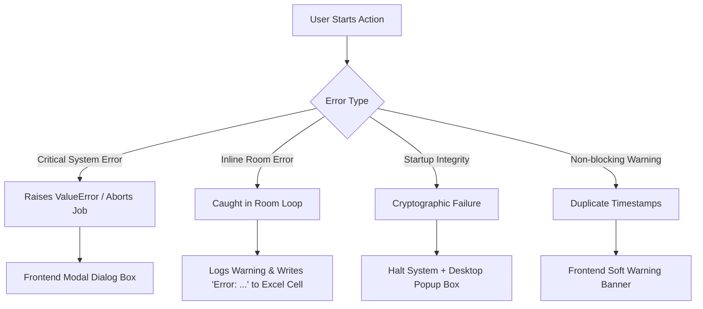

# Air Quality Review Project: System Analysis & Validation Test Cases

This document details the system-level differences between Phase I (BAS Standard) and Phase II (EMS Standard), analyzes the implementation of the 10 system Alarms (ERR-001 to ERR-010), and maps out a comprehensive set of test cases to verify the robust performance of the Air Quality Review System.

---

## 1. Phase I vs. Phase II Architecture & Formats

The system operates in two distinct modes depending on the data source. They differ in file structures, naming conventions, headers, and parsing logic.

| Dimension | Phase I (BAS Standard) | Phase II (EMS Standard) |
| :--- | :--- | :--- |
| **Data Source** | Building Automation System (BAS) | Environmental Monitoring System (EMS) |
| **File Structure** | Single consolidated CSV file per room containing all parameters (Temperature, Humidity, Pressure). | Separate CSV files for each parameter (Temperature: `_RMT_`, Humidity: `_RMH_`, Pressure: `_RDP_`). |
| **File Naming Pattern** | `[ROOM]_[MM-DD-YY]_[HH-MM].csv` Example: `1-P040_06-04-26_10-46.csv` | Separate files: - `[ROOM]_RMT_[YYYYMMDD]_[HHMMSS].csv` - `[ROOM]_RMH_[YYYYMMDD]_[HHMMSS].csv` - `[ROOM]_RDP_[YYYYMMDD]_[HHMMSS].csv` |
| **Semicolon vs. Comma** | Comma-delimited (`,`) | Semicolon-delimited (`;`) |
| **Header Offset** | Dynamic header index. The code searches for the string `<>Date` to locate the starting row (typically lines 9–11). | Static header offset. The code skips the first 4 rows (`skiprows=4`) and assumes column headers on line 5. |
| **Column Names** | Dynamic columns mapped from: `Point_1` (Temperature), `Point_2` (Humidity), `Point_3` (Pressure). | Unified columns: Column 0 (`DateTime`) and Column 2 (`Value`) are read from each file and merged. |
| **Temporal Alignment** | Standard 5-minute intervals contained in a single file; date range is extracted from the CSV file dates or parsed from the filename (minus 1 day legacy offset). | Time records may drift between separate RMT/RMH/RDP files. Timestamps are rounded to the nearest minute (`dt.round('min')`) and merged via outer joins. |
| **Missing Files Handling** | Mandatory columns (`DateTime`, `Temperature`, `Humidity`) must be in the single file. | Only `_RMT_` is strictly mandatory. If `_RMH_` or `_RDP_` files are missing, the system fills their columns with `pd.NA`. |
| **Encoding Requirements** | Parses using standard system encoding/UTF-8. | Parses using `utf-8` with `encoding_errors='ignore'`. |

---

## 2. Alarm Code Analysis (ERR-001 to ERR-010)

The system defines 10 distinct error codes. Depending on the severity and execution context, some raise critical blocking popups, while others write warnings inline to the final Excel report (silent/per-room errors).

### Alarm Mapping & UI Behaviors

#### **ERR-001: Header Missing**
* **Where Thrown**: `analysis_logic.py:prepare_df` (Line 191)
* **Trigger Condition**: In Phase I, the system reads lines of the CSV and searches for the `<>Date` cell. If not found, it raises a `ValueError`.
* **UI/UX Behavior**: Because it is thrown within the room loop, the exception is caught per file. The room is marked as failed, printing to the log: `FILE ERROR [room_id]: ... - ERR-001: ...`. The job completes, and the report writes `Error: ERR-001...` in the room cell. The user receives a general toast notification: `"Some files or rooms had errors. Please check the log."`

#### **ERR-002: Limit File Not Found**
* **Where Thrown**: `analysis_logic.py:analyze_files` (Line 781) and `analyze_files_phase2` (Line 1198)
* **Trigger Condition**: The specified `SetPointLimit.xlsx` file path does not exist.
* **UI/UX Behavior**: Fails the entire job execution immediately. The Flask API returns an HTTP 500 error, and the UI displays an error modal saying `"ERR-002: Limit File Not Found"`.

#### **ERR-003: Invalid Configuration**
* **Where Thrown**: `analysis_logic.py:_analyze_single_room_core` (Lines 540, 556)
* **Trigger Condition**: The setpoint limit values for the selected room contain non-numeric data (e.g. text characters, strings, or corrupt Excel values).
* **UI/UX Behavior**: Caught in the room processing loop. The room is skipped with `Error: ERR-003...` written in the Excel report cell. The user is warned on the UI screen to check the log.

#### **ERR-004: Audit Trail Corrupt**
* **Where Thrown**: `app.py` (Lines 71–88)
* **Trigger Condition**: The SHA-256 cryptographic hash validation of `logs/audit_trail.json` fails during system startup.
* **UI/UX Behavior**: Instantly halts application startup. Since the console window is normally hidden from users, the system spawns a desktop **Tkinter error message box** saying `"FATAL ERROR 004: Audit Trail Integrity Check Failed"` and terminates with `sys.exit(1)`.

#### **ERR-005: Invalid File Format**
* **Where Thrown**:
  - Phase I: `analysis_logic.py:prepare_df` (Line 238) — Mandatory columns (`DateTime`, `Temperature`, `Humidity`) are missing from the raw CSV.
  - Phase II: `analysis_logic.py:prepare_df_phase2` (Lines 1079, 1120) — No Temperature file (`_RMT_`) is present for the room, or the Temperature data fails to parse.
* **UI/UX Behavior**: Caught inside the room processing loop. The room is skipped, writing `Error: ERR-005...` to the final Excel sheet, and a soft warning is displayed on the dashboard.

#### **ERR-006: Logical Constraint**
* **Where Thrown**: `analysis_logic.py:_analyze_single_room_core` (Lines 551, 553)
* **Trigger Condition**: The setpoint configuration contains conflicting rules, such as `Humidity_High_Limit` < `Humidity_Low_Limit` or `Pressure_High_Limit` < `Pressure_Low_Limit`.
* **UI/UX Behavior**: Caught inside the room processing loop. Writes `Error: ERR-006...` to the Excel cell and reports a general warning on the page.

#### **ERR-007: Report Generation Failed**
* **Where Thrown**: `analysis_logic.py` (Lines 1021, 1398)
* **Trigger Condition**: The Excel workbook cannot be written to the `/reports` folder (e.g. disk is full, the directory is read-only, or the previous report file is locked open in Excel).
* **UI/UX Behavior**: Fails the entire run. The backend raises an exception that halts execution and shows an error modal to the user.

#### **ERR-008: Duplicate Timestamps**
* **Where Thrown**: `analysis_logic.py:prepare_df` (Line 218) and `prepare_df_phase2` (Line 1113)
* **Trigger Condition**: Raw CSV files contain multiple entries for the same datetime (either exact duplicates in raw data or collisions after Phase II rounding to nearest minute).
* **UI/UX Behavior**: Non-blocking. The system logs a warning, drops the subsequent duplicate records (keeping the first), and continues. After the job completes, the UI shows a soft warning banner: `"ERR-008: Duplicate timestamps detected and automatically resolved. Please check the log."`

#### **ERR-009: Invalid Limit File Format**
* **Where Thrown**: `analysis_logic.py` (Lines 431, 786, 1203)
* **Trigger Condition**: The limit spreadsheet lacks one or more of the required columns: `Room_number`, `Temperature_Limit`, `Humidity_Low_Limit`, `Humidity_High_Limit`, `Pressure_Low_Limit`, `Pressure_High_Limit`.
* **UI/UX Behavior**: Fails the entire run. The backend aborts immediately and pops up an error modal.

#### **ERR-010: No Matching Files Found**
* **Where Thrown**: `app.py` (Lines 506, 514, 540) in `/get-file-info`
* **Trigger Condition**: The selected folder contains no `.csv` files matching the chosen Phase mode (e.g. scanning a Phase I directory while in Phase II mode, or empty folders).
* **UI/UX Behavior**: Returns HTTP 400. Shows an alert dialog modal during folder selection.

---

## 3. Comprehensive Validation Test Catalog

This catalog outlines standard and edge-case testing scenarios for system validation.

### Category A: Date/Time Parsing & Filename Anomalies

#### TC-DT-01: Leap Year Rollover (Feb 29)
* **Objective**: Verify that the system correctly parses dates on February 29th during a leap year (e.g., 2024-02-29) and flags errors/skips on non-leap year entries (e.g., 2025-02-29).
* **Input**:
  - Phase I: CSV with date column containing `29/02/2024` (valid leap year) vs `29/02/2025` (invalid date, should coerce to `NaT` and skip or trigger warning).
  - Phase II: Separate RMT file with timestamp `29/02/2024 12:00:00`.
* **Expected Result**:
  - Leap year date is parsed successfully and analyzed.
  - Non-leap year invalid date fails to parse, coerces to `NaT` and is dropped during `dropna()`, potentially logging a data loss warning if it falls within the analysis range.

#### TC-DT-02: Timestamp Format Drift (12h vs 24h & Seconds Mismatch)
* **Objective**: Verify that drift in timestamp formats (e.g., 12-hour AM/PM suffix, missing seconds, or differing formats between Phase II RMT/RMH/RDP files) is parsed correctly.
* **Input**:
  - Phase II RMT: `2026-06-04 10:46 AM` (12h, missing seconds).
  - Phase II RMH: `2026-06-04 10:46:00` (24h, with seconds).
  - Phase II RDP: `04-06-2026 10:46:05` (mismatched format).
* **Expected Result**:
  - `pd.to_datetime` handles various formats and aligns timestamps correctly.
  - Phase II rounding to nearest minute (`dt.round('min')`) merges them into a single row at `2026-06-04 10:46` using outer join without raising exceptions.

#### TC-DT-03: Filename Date Mismatch with Content Date
* **Objective**: Test system behavior when the date embedded in the filename (e.g., `1-P040_06-03-26_10-46.csv`) differs from the date values contained inside the CSV body.
* **Input**: Filename lists `06-03-26` but internal data starts on `06-04-26`.
* **Expected Result**:
  - For Phase I, filename date determines date range mapping if not overriding via UI, but data is evaluated based on the actual internal `DateTime` column.
  - System successfully processes internal data records; if internal dates fall outside the date range window defined by the filename (minus 1 day offset), the records are filtered out, resulting in `df.empty` (returns `None` for the room).

---

### Category B: Phase II File Combinations & Optional Parameters

#### TC-P2-01: RMT Only (Temperature Only Room)
* **Objective**: Verify system handles rooms where only temperature is monitored.
* **Input**: Phase II folder containing only `[ROOM]_RMT_[DATE]_[TIME].csv` but no `_RMH_` or `_RDP_` files.
* **Expected Result**:
  - Room parsed successfully. Humidity and Pressure are populated with `pd.NA`.
  - Excel report outputs Temperature status correctly, while Humidity and Pressure cells print `N/A`.

#### TC-P2-02: RMT + RMH (No Pressure)
* **Objective**: Verify system handles rooms with temperature and humidity but no pressure sensor.
* **Input**: Phase II folder with `_RMT_` and `_RMH_` files but no `_RDP_` file.
* **Expected Result**:
  - Room parsed successfully. Temperature and Humidity analyzed. Pressure filled with `pd.NA` and outputs `N/A` in report.

#### TC-P2-03: Missing Mandatory RMT file (RMH + RDP present)
* **Objective**: Verify that the absence of the Temperature file triggers `ERR-005`.
* **Input**: Phase II folder with `_RMH_` and `_RDP_` files but no `_RMT_` file.
* **Expected Result**:
  - System catches `ValueError` inside room loop: `ERR-005: No Temperature file (_RMT_) found`.
  - Writes `Error: ERR-005...` to the final Excel cell for that room.

#### TC-P2-04: Unrecognized Files in Directory
* **Objective**: Ensure that auxiliary files (like log files, READMEs, or `.xlsx` sheets) inside Phase II room directories do not disrupt the scanning logic.
* **Input**: Room folder containing valid `_RMT_` files plus `notes.txt` and `image.png`.
* **Expected Result**:
  - Scanning logic filters only for files containing `_RMT_` (or `_RMH_`/`_RDP_`) and ending with `.csv`.
  - Auxiliary files are silently ignored, and processing completes normally.

---

### Category C: Delimiter & File Encoding Variations

#### TC-DF-01: Phase Mode Delimiter Mismatch
* **Objective**: Test robustness when user selects Phase I mode on a Phase II CSV, or Phase II mode on a Phase I CSV.
* **Input**:
  - Run Phase I mode on semicolon-delimited Phase II files.
  - Run Phase II mode on comma-delimited Phase I files.
* **Expected Result**:
  - Delimiter mismatch causes column parsing to fail.
  - Phase I mode on Phase II file: fails to find `<>Date` since comma splits are incorrect -> triggers `ERR-001`.
  - Phase II mode on Phase I file: `pd.read_csv(sep=';')` reads entire row into one column -> column index 2 is out of bounds or parsing fails -> triggers `ERR-005` (No valid Temperature data parsed).

#### TC-DF-02: Text Encoding Variations (UTF-8-BOM, UTF-16, ANSI)
* **Objective**: Verify the system handles files saved with different text encodings.
* **Input**:
  - CSV files encoded in `UTF-8 with BOM` (Byte Order Mark).
  - CSV files encoded in `Windows-1252 (ANSI)`.
  - CSV files encoded in `UTF-16` (not supported by default).
* **Expected Result**:
  - UTF-8 with BOM: `encoding='utf-8'` and `errors='ignore'` successfully skips/handles BOM and reads correctly.
  - ANSI: read successfully due to `errors='ignore'` or matching charset characters.
  - UTF-16: triggers parsing exception, leading to `ERR-005` or `ERR-001` due to unrecognized binary characters.

---

### Category D: CSV Data Corruption & Non-Numeric Placeholders

#### TC-DC-01: Blank Lines & Null Values
* **Objective**: Ensure files with blank lines or empty cells are handled without crashing.
* **Input**: CSV containing blank rows at the top, inside the data block, and at the end of the file.
* **Expected Result**:
  - Empty rows are skipped or dropped during parsing (`dropna()` on DateTime).
  - System runs to completion.

#### TC-DC-02: Non-Numeric Value Placeholders
* **Objective**: Verify that non-numeric values inside the measurement columns (e.g., `-`, `null`, `NaN`, `***`, `Error`, or text comments) are coerced to nulls and logged as a warning.
* **Input**:
  - Temperature column contains a row with value `***` or `NaN`.
  - Humidity column contains `N/A` for a few rows.
* **Expected Result**:
  - `pd.to_numeric(errors='coerce')` converts invalid strings into `NaN`.
  - System logs a warning: `Non-numeric data found in column...` (under `WARNING` event in audit trail).
  - The specific intervals with `NaN` are flagged as "Data Loss" in the report instead of crashing.

---

### Category E: Excel Limit File Edge Cases

#### TC-LF-01: Duplicate Room Records in SetPointLimit.xlsx
* **Objective**: Analyze behavior when the same room number is declared multiple times in the limit configuration sheet.
* **Input**: `SetPointLimit.xlsx` containing two rows for room `1-P040` (first row has `Temperature_Limit = 22`, second row has `Temperature_Limit = 25`).
* **Expected Result**:
  - The system queries using `setpoint_df[... == room_num]`, then accesses limit values using `.iloc[0]`.
  - It silently uses the limits from the first matching row (`22`) and ignores the second row. No error is raised.

#### TC-LF-02: Missing Optional limits in SetPointLimit.xlsx
* **Objective**: Verify behavior when optional limits (like humidity or pressure) are left blank in the Excel config.
* **Input**: Setpoint sheet has empty cells for `Humidity_Low_Limit` and `Humidity_High_Limit` for room `1-P040`.
* **Expected Result**:
  - `pd.isna` evaluates to True.
  - System sets `humidity_has_spec` to False.
  - Analysis for Humidity displays as `N/A` in the report, enforcing no rules.

---

### Alarm Validation Matrix

| Test Case ID | Target Alarm | Input Scenario / Description | Expected System Output | UI Result |
| :--- | :--- | :--- | :--- | :--- |
| **TC-001-01** | **ERR-001** | Raw Phase I file lacks `<>Date` cell. | ValueError raised in `prepare_df` | Skip room; print error in Excel cell; show dashboard toast. |
| **TC-002-01** | **ERR-002** | `SetPointLimit.xlsx` deleted/missing. | ValueError raised in main loop | Abort job; display critical modal popup. |
| **TC-003-01** | **ERR-003** | Temp limit is text `"TBD"` in setpoints. | ValueError raised in room core | Skip room; print error in Excel cell. |
| **TC-004-01** | **ERR-004** | Tamper with `audit_trail.json` file hash. | Signature check fails on boot | Halt app; show Tkinter error dialog. |
| **TC-005-01** | **ERR-005** | Humidity column missing in Phase I CSV. | ValueError raised in `prepare_df` | Skip room; print format error in Excel cell. |
| **TC-005-02** | **ERR-005** | Missing `_RMT_` file in Phase II folder. | ValueError raised in `prepare_df_phase2` | Skip room; print error in Excel cell. |
| **TC-006-01** | **ERR-006** | Humidity High Limit (40) < Low Limit (50). | ValueError raised in room core | Skip room; print constraint error in Excel cell. |
| **TC-007-01** | **ERR-007** | Report file already open in Excel. | PermissionError on workbook save | Abort job; display error modal popup. |
| **TC-008-01** | **ERR-008** | Duplicate datetimes in CSV file. | Logs `DUPLICATE_TIMESTAMPS_WARN` | Drop subsequent records; show soft warning banner. |
| **TC-009-01** | **ERR-009** | Column `Room_number` missing in limit sheet. | ValueError raised on load | Abort job; display critical format modal popup. |
| **TC-010-01** | **ERR-010** | Load folder contains no CSV files. | Returns HTTP 400 | Show UI folder scan alert modal. |
